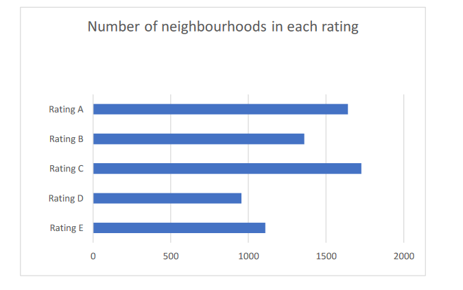

```{r setup, include=FALSE}
knitr::opts_chunk$set(echo = TRUE)
```

```{r}
library(tidyverse)
library(readxl)
library(RColorBrewer)
library(cowplot)
library(gt)
library(ggridges)
library(janitor)

theme_set(theme_minimal())

```

## Objectives

## Context

**National:**

-   Funding challenges parks
-   Housing shortages
-   Leveling up agenda

**Personal:**

-   

## The Friends of the Earth Report - "England's Green Space Gap"

-   Friends of the Earth (FoE) recently released a report detailing their research into "England's Green Space Gap".
-   As part of their research FoE developed a new approach for classifying the extent of green space deprivation across English neighbourhoods (i.e. English MSOAs).
-   Neighbourhoods are classified into five groups - A (least green space deprived), B, C, D and E (most green space deprived).
-   This classification is based on analysis of two datasets from the ONS detailing: (1) the amount garden space; and, (2) the accessibility of public green spaces (parks etc.).
-   In the report, FOE also draw on the ONS Index of Multiple Deprivation (IMD) dataset to explore the relationship between green space deprivation and demographic factors (including ethnicity and income).
-   FoE have released the dataset which informs the "England's Green Space Gap" report. This dataset includes the FoE green space classification for each English neighborhood, alongside IMD data.
-   Reading the report and exploring the associated dataset, I was struck by a number of questions about the nature and scope of green space deprivation in England. I thought that these questions might be a good basis for an exploratory data analysis, which might extend upon the FoE analysis and contribute to the wider debate on maintaining and extending access to green space during the post-covid recovery.

## Questions for Exploratory Data Analysis

**Where is green space deprivation experienced?**

-   *Green space deprivation:*

    -   What is the scale of the green space deprivation problem in England?

        -   How many neighborhoods could be considered green space deprived?
        -   How many people live in green space deprived neighborhoods?
        -   How are FoE's green space deprivation ratings distributed?

    -   [Is green space deprivation an urban problem? 2001 classification](https://geoportal.statistics.gov.uk/datasets/rural-urban-classification-2001-of-msoas-in-england-and-wales)?

        -   Have FoE defined green space deprivation as an urban problem?
        -   Does the underpinning data justify this?

    -   How do the two dimensions of green space deprivation (availability of garden space and accessibility of public green space) relate to each other?

        -   Is there a trade-off between garden space and access to public green space?

    -   How is green space deprivation distributed across regions and a local authorities in England?

        -   Where are the cities/regions where action is most needed?
        -   Which local authorities have the highest/lowest proportion of D and E rated neighborhoods?

**Who is living with green space deprivation?**

-   *Ethnicity and green space deprivation:*

    -   Are people from a BAME background more likely, than white people, to experience green space deprivation?
    -   Is the proportion of BAME population within an MSOA associated with the MSOA's green space deprivation rating?

-   *Age and green space deprivation:*

    -   Are different age groups more or less likely to experience green space deprivation?

-   *Wealth and green space deprivation:*

**The relationship between green space deprivation and health?**

-   *Covid and green space deprivation:*

    -   Have populations living in green space deprived area experienced a greater covid-19 burden, relative to people living in green space affluent areas.

-   *Life expectancy and green space deprivation:*

**Ideas:**

-   Plot idea - garden space vs. access to public green space - colour by rating ...
-   Use above and below median income to facet plots (as in covid-19) ...
-   Is there an equivalent approach for ethnicity? Where might the boundary be drawn (the national average proportion of BAME population)?
-   Green space affluent vs. green space deprived?

## Data sources used

```{r}

data_sources <- tribble(
  ~file_name, ~name, ~notes, ~url,
  "(FOE) Green Space Consolidated Data - England - Version 2.1.xlsx", "green_space", "...", "https://friendsoftheearth.uk/nature/green-space-consolidated-data-england",
  "Local_Authority_District_to_Region__December_2019__Lookup_in_England.csv", "LAD_to_region", "used the December 2019 version", "https://geoportal.statistics.gov.uk/datasets/3ba3daf9278f47daba0f561889c3521a_0"
)

data_sources %>% 
  gt()

```

Local Authority District to Region lookup (December 2019 used) - <https://geoportal.statistics.gov.uk/datasets/3ba3daf9278f47daba0f561889c3521a_0>

```{r}
green_space <- read_excel("../Data/(FOE) Green Space Consolidated Data - England - Version 2.1.xlsx",
                          sheet = "MSOAs V2.1") %>%
  # inconsistent naming conventions for variables are used in the source data
  # some need to clean names for consitency
  clean_names()

green_space %>% 
  select(la_code)

# FOE green space data doesn't include a variable for the region each MSOA/local authority lies within
# So, import a look up table from the ONS, which maps between Local Authority Districts and Regions
LAD_to_region <- read_csv("../Data/Local_Authority_District_to_Region__December_2019__Lookup_in_England.csv") %>% 
  select(-FID, -LAD19NM)

LAD_to_region

# add region names and codes (from ONS look up) to FOE green space data
green_space <- green_space %>% 
  left_join(LAD_to_region, by = c("la_code" = "LAD19CD")) %>% 
  relocate(RGN19CD, RGN19NM, .before = area) %>% 
  rename(region_code = RGN19CD,
         region_name = RGN19NM)

green_space
```

## The distribution of green space deprivation ratings across England

```{r}
green_space %>% 
  tabyl(green_space_deprivation_rating)
```

<https://themockup.blog/posts/2020-09-04-10-table-rules-in-r/> <http://applied-r.com/r-color-tables/>

to add?

-   Columns on what the rating means
-   Examples of a place where we might find a neighbourhood

```{r}

colour_gs_row <- function(df, colour, rating){
  df %>% 
    tab_style(style = list(cell_fill(color = colour_scale[[colour]])),
                locations = cells_body(rows = green_space_deprivation_rating == rating)
                )
}

colour_gs_rows <-  function(df){
  
  df %>% 
    colour_gs_row(colour = 5, rating = "E") %>%
    colour_gs_row(colour = 4, rating = "D") %>%
    colour_gs_row(colour = 3, rating = "C") %>%
    colour_gs_row(colour = 2, rating = "B") %>%
    colour_gs_row(colour = 1, rating = "A")
}

# set green to grey colour scale for tables and graphs
colour_palette <- scales::seq_gradient_pal(low = "palegreen4", high = "grey")
colour_scale <- colour_palette(seq(0, 1, length.out = 5))

background_colour <- "#EDEDED"

# set labels for grouping the rows in the table below
d_e_group_label <- "\nUrgent action needed to improve access to green space"
a_b_c_group_label <-  "\nAction needed to protect access to green space"


# for each green space deprivation rate calculate the numbers and proportions of msoas
msoa_by_rating <- green_space %>% 
  tabyl(green_space_deprivation_rating) %>%
  mutate(percent = percent * 100) %>% 
  rename(n_msoa = n,
         percent_msoa = percent)

# for each green space deprivation rate calculate the numbers and proportions of the population
pop_by_rating <- green_space %>% 
  group_by(green_space_deprivation_rating) %>% 
  summarise(population = sum(population_imd)) %>% 
  
  ungroup() %>% 
  mutate(percent_pop = population / sum(population) * 100)

# merge the msoa and population tables
msoa_and_pop_by_rating <- msoa_by_rating %>% 
  left_join(pop_by_rating, by = c("green_space_deprivation_rating" = "green_space_deprivation_rating"))


msoa_and_pop_by_rating %>%
  
  add_column(group = c(rep(a_b_c_group_label, 3), rep(d_e_group_label, 2))) %>% 
  arrange(desc(green_space_deprivation_rating)) %>% 


  gt(rowname_col = "green_space_deprivation_rating", groupname_col = "group") %>%
  
    # add spanners
    tab_spanner(label = "Neighbourhoods",
                columns = 2:3) %>% 
  
    tab_spanner(label = "Population",
                columns = 4:5) %>% 
  
    # format columns
    fmt_number(starts_with("percent_"), decimals = 0) %>%
    fmt_number(vars(population), scale_by = 1e-6) %>%
  
    # create and format summary rows for each group
    summary_rows(groups = TRUE,
                 columns = vars(population),
                 fns = list(Total = ~sum(.)),
                 formatter = fmt_number,
                 scale_by = 1e-6) %>%
  
    summary_rows(groups = TRUE,
                 columns = vars(n_msoa, percent_msoa, percent_pop),
                 fns = list(Total = ~sum(.)),
                 formatter = fmt_number,
                 decimals = 0
                 ) %>%

    
    # colour rows using the function defined above
    colour_gs_rows() %>% 

    # add table labels
    tab_stubhead(label = html("Green Space<br>Deprivation<br>Rating")) %>%  
    cols_label(n_msoa = "Number",
               percent_msoa = "%",
               population = "Millions of people",
               percent_pop = "%") %>% 
    tab_source_note(source_note = md("**Source:** Friends of the Earth")) %>% 
    tab_header(title = md("**Green Space Deprivation in England**"),
               subtitle = md("Understanding the scale of the problem")
               ) %>%

    # adjust the appearance of table elements
    tab_options(heading.align = "left",
                heading.subtitle.font.size = 12,
                table.border.top.color = "black",
                column_labels.border.bottom.color = "black",
                column_labels.border.bottom.width = 3,
                column_labels.background.color = background_colour, 
                summary_row.background.color = background_colour,
                row_group.background.color = "#FFFFFF",
                stub.background.color = background_colour, 
                source_notes.font.size = 10) %>%
    
    # adjust styling of table text
    tab_style(style = list(cell_text(style = "italic")),
          locations = list(cells_body(columns = c(3,5)),
                           cells_row_groups(),
                           cells_summary(columns = vars(percent_msoa, percent_pop)))
          ) %>% 
  
    tab_style(style = list(cell_text(weight = "bold")),
          locations = list(cells_summary(),
                           cells_column_labels(everything())
                           )
          ) %>%
  
    tab_style(style = list(cell_text(size = 12)),
              locations = list(cells_row_groups(),
                               cells_column_labels(everything()))
              ) %>% 
  
  
    tab_style(style = list(cell_text(weight = "bold", size = 14)),
              locations = list(cells_stubhead(), 
                               cells_column_spanners(spanners = c("Neighbourhoods", "Population")),
                               cells_stub()
                               )
              ) %>% 

    tab_style(style = list(cell_text(align = "center")),
                           locations = cells_stub()
                           )
              
              
  
  
```

```{r}
# As a starting point - select the three indices (GSDI_...) that make up the rating (and the data that these indices are calculated from)
gs_dep_by_rating <- green_space %>% 

  select(green_space_deprivation_rating, 
         gsdi_avg_area, green_space_area_per_capita,
         gsdi_access, pcnt_pop_area_with_go_space_access, 
         gsdi_garden, garden_area_per_capita)

# trying to understand what a typical MSOA in each rating looks like ...
gs_dep_by_rating %>% 
  
  group_by(green_space_deprivation_rating) %>%
  summarise(mean_gs_per_c = mean(green_space_area_per_capita, na.rm = TRUE),
            median_gs_per_c = median(green_space_area_per_capita, na.rm = TRUE),
            mean_perc_pop_with_gs_access = mean(pcnt_pop_area_with_go_space_access, na.rm = TRUE),
            median_perc_pop_with_gs_access = median(pcnt_pop_area_with_go_space_access, na.rm = TRUE),
            mean_gard_area_per_C = mean(garden_area_per_capita, na.rm = TRUE),
            median_gard_area_per_C = median(garden_area_per_capita, na.rm = TRUE)
            )


```

## Green space area per capita

dealing with outliers Boxplot shows outliers at 1.5\*IQR + Q3 - they are part of the natural variability of the population, so it seems appropriate to retain the outliers, but zoom on the graphs because the .

```{r}
box_plot_mapping = aes(x = green_space_area_per_capita,
                       y = green_space_deprivation_rating)

# may be plotting will help to understand what a typical MSOA in each rating looks like
p <- ggplot(data = gs_dep_by_rating,
            mapping = box_plot_mapping
            )

p + geom_boxplot(aes(group = green_space_deprivation_rating))

# the outliers (in terms of very high values of green space per capita) are making it difficult to get a handle on the distributions
# so identify the approximate value where outliers begin
p <- ggplot(data = gs_dep_by_rating,
            mapping = aes(x = green_space_area_per_capita))

p + geom_boxplot()

# taking the dataset as whole outliers begin at approx. 62.5m2 gs per capita
# this seems like a low value to use as a cut off point for outliers
# so lets look at group A in detail
p <- ggplot(data = gs_dep_by_rating %>% 
              filter(green_space_deprivation_rating == "A"),
            mapping = box_plot_mapping)

p + geom_boxplot() +
  coord_cartesian(xlim = c(0, 1000))

# outliers from rating group A start at approximately 500m2 gs per capita
```

not sure on whether or not to filter out outliers

```{r}
p <- ggplot(data = gs_dep_by_rating, #%>% 
            #filter(green_space_area_per_capita < 500),
            mapping = box_plot_mapping
            )

p + geom_jitter(colour = "grey80") +
  geom_boxplot(mapping = aes(group = green_space_deprivation_rating, 
                               fill = green_space_deprivation_rating
                               ),
                 alpha = 0.5
                 ) + 
  coord_cartesian(xlim = c(0, 500)) +
  
  guides(fill = FALSE)

gs_pc_summary <- green_space %>% 
  group_by(green_space_deprivation_rating) %>% 
  summarise(
    min = min(green_space_area_per_capita),
    median = median(green_space_area_per_capita),
    max = max(green_space_area_per_capita),
    iqr = IQR(green_space_area_per_capita),
    mean = mean(green_space_area_per_capita),
    sd = sd(green_space_area_per_capita)
  )

gs_pc_summary
                 
```

```{r}
p <- ggplot(data = gs_dep_by_rating, #%>% 
              #filter(green_space_area_per_capita < 500),
            mapping = aes(x = green_space_area_per_capita,
                          y = green_space_deprivation_rating,
                          fill = green_space_deprivation_rating)
            )

p + geom_density_ridges(alpha = 0.5) + xlim(0,200) + 
  
  
  guides(fill = FALSE)
```

So, I wondered if the outliers/very long tail are a result of areas with small populations and/very large areas of green space.

```{r}
p <- ggplot(data = green_space,
            mapping = aes(x = population_imd,
                          colour = green_space_deprivation_rating)
            )

p + geom_point(mapping = aes(y = green_space_area), 
               alpha = 0.5) +
  
  labs(colour = "GS rating") +
  facet_wrap(~green_space_deprivation_rating)


p + geom_point(mapping = aes(y = log(green_space_area)),
               alpha = 0.5) +
  labs(colour = "GS rating")
```

```{r}
p <- ggplot(data = green_space, 
            mapping = aes(x = log(green_space_area),
                          )
            )
p + geom_density()


p <- ggplot(data = green_space, 
            mapping = aes(x = population_imd,
                          )
            )
p + geom_density()
```

So, it looks like the it is the green space area has much more influence on green space area per capita, than population.

```{r}
p <- ggplot(data = green_space,
            mapping = aes(y = green_space_area_per_capita,
                          colour = green_space_deprivation_rating)
            )

p + geom_point(mapping = aes(x = green_space_area), 
               alpha = 0.5) +
  labs(colour = "GS rating") +
  facet_wrap(~ green_space_deprivation_rating, scales = "free")

p <- p + geom_point(mapping = aes(x = population_imd), 
               alpha = 0.5) +
  labs(colour = "GS rating")

p

p + ylim(0, 500) + facet_wrap(~ green_space_deprivation_rating, scales = "free_y")
```

So, lets look at the distribution of `green_space_area` itself. This is relatively tricky given the wide range of values (as shown in the summary stats). I tried histograms and density plots too, but a box plot seemed the best way to understand the distribution. The first boxplot shows the full distribution and as a result is very difficult to interpret as the large outliers to the right of plot result in the box itself appearing as a single line and hence being very difficult to interpret. In the second plot hte x axis is cropped so it is straight forward to interpret the box component of the plot. However, this comes at the cost of failing to show the very large outliers within the distribution.

The extreme skew of the distribution can be seen in the summary statistics below. The median for `green_space_area` is 152,418 m2 while the maximum 636,087,671 m2.

```{r}

gs_area_summary <- function(variable, xlim){
  
  print(green_space %>% select({{variable}}) %>% summary())

  p <- ggplot(data = green_space,
              mapping = aes(x = {{variable}}))
  
  plot(p + geom_boxplot())
  
  p + geom_boxplot() +
    coord_cartesian(xlim = xlim)
  
}

gs_area_summary(green_space_area, c(0, 1e6))

# trying different lengths of the x axis to try to understand the distribution
  # p <- p + 
  #   geom_boxplot()
  # 
  # c(10, 100, 1000, 10000, 100000, 1e6, 1e7, 1e8, 1e9) %>% 
  #   map(~ p + coord_cartesian(xlim = c(0, .x)))
```

A similarly extreme right skewed distribution can seen for `green_space_area_per_capita`, as shown in the plots and summary stats below. It is worth noting just how atypical many of the larger outliers are. The median for `green_space_area_per_capita` is less than 20 m2 per capita, while the maximum is approximately 100,000 m2 per capita.

```{r}
gs_area_summary(green_space_area_per_capita, c(0, 100))
```

So, I thought it was worth a quick look at the population density across English MSOAs. The first graph shows the kernel density function for the population density of English MSOAs. Key features of the distribution include:

-   Approximating an exponential decline in density (a proxy for number of MSOAs) as population density increases.
-   The modal value being close to zero,

The second plot groups MSOAs by their FoE green space deprivation rating and highlights:

-   A rated MSOAs (those least green space deprived) tend to have low population density. For these MSOAs we again see an exponential decline in density as population density increases.
-   As green space deprivation increases (moving from rating A to E), the KDE's widen and seem to tend more toward a normal-like distribution.

```{r}
green_space %>% 
  select(population_density) %>% 
  summary()

p <- ggplot(data = green_space,
            mapping = aes(x = population_density
                          )
            )

p + geom_density()
p + geom_density(mapping =aes(fill = green_space_deprivation_rating),
                 alpha = 0.4)
```

Plotting population density against green space area and green space area per capita produces very associations. Note the log scales on both the x and y axis in both cases.

```{r}
p <- ggplot(data = green_space,
            mapping = aes(x = log(population_density),
                          colour = green_space_deprivation_rating
                          )
            )

p + geom_point(mapping = aes(y = log(green_space_area)),
            alpha = 0.25) +
  labs(colour = "GS rating")

p + geom_point(mapping = aes(y = log(green_space_area_per_capita)),
               alpha = 0.25) +
  labs(colour = "GS rating") 


```

## Green space access

* From histogram:
  - from 0 to approx. 40% the frequency distribution of `pcnt_pop_with_go_space_access` is uniform.
  - from approx. 40% to 100% there is a negative linear association between `pcnt_pop_with_go_space_access` and frequency. 
* from the boxplot with grouping by rating
  - ratings A,C and E have similar distributions of percentage populations with good access to green space.
  - rating B and D have similar distributions of percentage populations with good access to green space.
  - at each rating there is a wide variation in the percentage of populations with good access to green space
* Overall it is not clear to what extent `pcnt_pop_with_go_space_access` is influencing the ratings ... would dropping it make much difference to how MSOA are classified?
* 75% `pcnt_pop_with_go_space_access` is used as a cut off point for some classifications. This figure seems high, it is at approximately the 95th percentile (see calculation below).

```{r}

rating_component_plots <- function(){
  
  # looking at the distribution of rating_component
  plot(p + geom_density())
  
  plot(p + geom_density(mapping = aes(fill = green_space_deprivation_rating),
                   alpha = 0.4))
  
  plot(p + geom_boxplot())
  
  plot(p + geom_histogram())
  
  
  # break down prating_component distribution by green space deprivation rating
  p + geom_jitter(mapping = aes(y = green_space_deprivation_rating), 
                alpha = 0.2, 
                colour = "grey50") +
    geom_boxplot(mapping = aes(y = green_space_deprivation_rating,
                              fill = green_space_deprivation_rating), alpha = 0.5) +
    guides(fill = FALSE)
}

p <- ggplot(data = green_space,
            mapping = aes(x = pcnt_pop_with_go_space_access)
            )

rating_component_plots()

# looking at assocation between pcnt_pop_with_go_space_access and the other 
# two variables that inform the green space deprivation rating
p + geom_point(mapping = aes(y = log(green_space_area_per_capita),
                             colour = green_space_deprivation_rating)
               )

p + geom_point(mapping = aes(y = log(garden_area_per_capita),
                             colour = green_space_deprivation_rating)
                 )

# calculate the percentile of the cutoff value used in FoE classification
percentile <- ecdf(green_space$pcnt_pop_with_go_space_access)
percentile(75)


green_space
```
```{r}
grouped_summary <- function(df, grouping_var, summary_var){
  df %>% 
    group_by({{grouping_var}}) %>% 
    summarise(min = min({{summary_var}}),
              median = median({{summary_var}}),
              max = max({{summary_var}}),
              iqr = IQR({{summary_var}}),
              mean = mean({{summary_var}}),
              sd = sd({{summary_var}})
    )
}

grouped_summary(df = green_space, 
                grouping_var = green_space_deprivation_rating,
                summary_var = pcnt_pop_with_go_space_access) %>% 
  gt()
  
```

## Garden space 

```{r}

# produce plots for garden_area_per_capita
p <- ggplot(data = green_space %>% 
              filter(garden_area_per_capita < 4000),# remove one outlier around 
                                                    # 5000m2 to make plots readable
            mapping = aes(x = garden_area_per_capita)
            )

rating_component_plots()
# 
# # 
# p <- ggplot(data = green_space,
#             mapping = aes(x = log(garden_area_per_capita))
#             )
# 
# rating_component_plots()

grouped_summary(df = green_space, 
                grouping_var = green_space_deprivation_rating,
                summary_var = garden_area_per_capita) %>% 
  gt()
```


## Urban-rural classification and green space deprivation ratings 
Rural-urban classification at LA scale

<https://www.gov.uk/government/statistics/local-authority-rural-urban-classification> Rural-Urban Classification of Local Authorities Post-2009 Boundaries

```{r}
readxl::read_xls("../Data/la-class-dataset-post0409.xls", sheet = "England")
```

Rural-urban classication at MSOA scale

<https://geoportal.statistics.gov.uk/datasets/rural-urban-classification-2001-of-msoas-in-england-and-wales>

```{r}
file_loc <- "../Data/Rural_Urban_Classification_(2001)_for_MSOAs_in_England_and_Wales/RUC_MSOA_2001_EW_LU.csv"

urban_rural_classification <- readr::read_csv(file_loc) %>%
  clean_names() %>% 
  select(msoa01cd, ruc01nm, ruc01cd, morphology_name, morphology_code, context_name, context_code)

urban_rural_classification

# check if any of the parsing problems relate to the columns of interest
columns_of_interest <-  c("MSOA01CD", "RUC01NM", "RUC01CD", "Morphology Name", 
                          "Morphology Code", "Context Name", "Context Code")  

problems(urban_rural_classification) %>% 
  filter(col %in% columns_of_interest)
```

```{r}
green_space_urban_rural <- green_space %>% 
  left_join(urban_rural_classification, by = c("msoa_code" = "msoa01cd")) 

green_space_urban_rural
```

 * Urban rural classifications weren't available for 150 (approx. 2%) of MSOAs. This isn't ideal, but I don't think it will cause any big problems to drop these from further analyses that require these classification ...
 * there are only 8 MSOAs not in urban areas classified with a green space deprivation rating of D or E.
 * but almost 40% of urban MSOAs have green space deprivation ratings of A or B.

```{r}
# p <- ggplot(data = green_space_urban_rural,
#             mapping = aes(y = green_space_deprivation_rating))
# 
# p + geom_tile(mapping = aes(x = ruc01cd))


green_space_urban_rural %>% 
  tabyl(green_space_deprivation_rating, morphology_name) %>% 
  adorn_totals("row") %>% 
  adorn_percentages("col") %>% 
  adorn_pct_formatting(rounding = "half up", digits = 0) %>%
  adorn_ns() %>%
  
  gt()
  # gt() %>%
  # grand_summary_rows(columns = vars(`Town and Fringe`, `Urban > 10K`,
  #                                   `Village Hamlet & Isolated Dwellings`, NA_),
  #                    fns = c(total = ~sum(.))
  #                    )
```

**Some thoughts on where I am in understanding the FoE ratings and `green_space_area`:**

-   Given the distributions of `green_space_area` and `green_space_area_per_capita` it doesn't make sense to me to talk solely about green space deprivation. There are clearly places that are green space affluent ... For example, the typical (median) amount of green space area per capita for an MSOA is 20 m2. Whilst, the MSOA with the most green space per capita has approximately 5000 times more green space per capita than the typical MSOA. But I guess FoE are following the terminology/approach of the Indices of Multiple Deprivation dataset provided by the ONS.
-   Considering the typical (median) amount of `green_space_area_per_capita` for MSOAs in each rating (as shown in the table below) raises a question in my mind as the amounts of `green_space_area_per_capita` are relatively similar across ratings E to B ... Is it a different experience to live in a neighborhood with approximately 3m2 `green_space_area_per_capita` (as is typical for a E rated MSOA) or with approximately 16m2 `green_space_area_per_capita` (as is typical for a E rated MSOA)? Which got me wondering how much green space is enough [@russo2018] - it appear that this is a question that hasn't been the subject of too much research to date ...
-   

```{r}

gs_pc_summary

gs_pc_summary %>% 
  select(green_space_deprivation_rating, median, iqr)

green_space %>% 
  select(garden_area_per_capita) %>% 
  summary()


green_space

p <- ggplot(data = green_space,
            mapping = aes(x = green_space_area_per_capita,
                          y = garden_area_per_capita)
            )

p + geom_point()
```


# An alternative appraoch - clustering

https://community.alteryx.com/t5/Alteryx-Designer-Knowledge-Base/Standardization-in-Cluster-Analysis/ta-p/302296


```{r}
p <- ggplot(data = green_space_urban_rural)            

p + geom_density(mapping = aes(x = garden_area_per_capita))

p + geom_density(mapping = aes(x = log(green_space_area_per_capita + 1)))
p + geom_density(mapping = aes(x = log(garden_area_per_capita + 1)))
p + geom_density(mapping = aes(x = pcnt_pop_area_with_go_space_access))
```

* I think it might be actively helpful to remove the right skew from the two green space variables in the context of looking at green space deprivation. Why?
  - I don't there is much practically significant difference between having 10,000m2 and 100,000m2 per capita of public green space in terms people living there having a sense/experience of green space deprivation. And, the same probably holds for garden space too ...
  - This might save on more complex work further down the line e.g. trying to define a green space utility function ... 

* The the data from all three variables definitely needs transforming to lie on a scale of 0 to 1, to ensure that the kmeans algorithm applies a roughly equal weight to each variable. When putting the raw data into kmeans, `green_space_area_per_capita` is the predominant factor in determining clusters due to the fact that it's values are much larger than those of the other variables ...

```{r}
library(tidymodels)
library(tidyverse)

green_space_urban_rural %>%
  distinct(morphology_name, morphology_code) 
  
# select variables of interest  
cluster_variables <- green_space_urban_rural %>% 
  select(msoa_name,
         green_space_area_per_capita,
         pcnt_pop_area_with_go_space_access,
         garden_area_per_capita)


unit_interval <- function(x){
  (x - min(x)) / (max(x) - min(x))
}

# transform variable to remove skew
cluster_variables %>% 
  mutate(log_green_space_area_per_capita = log(green_space_area_per_capita + 1),
         log_garden_area_per_capita = log(garden_area_per_capita + 1), # +1 require because log(0) is not defined
         ui_log_green_space_area_per_capita = unit_interval(log_green_space_area_per_capita),
         ui_log_garden_area_per_capita = unit_interval(log_garden_area_per_capita)) %>%  
  summary()
  


# standardise the 
cluster_variables %>% 
  mutate(ui_green_space_area_per_capita = unit_interval(green_space_area_per_capita)) %>% 
  select(ui_green_space_area_per_capita) %>% 
  summary()


# check for na's
cluster_variables %>% 
  summarise(across(.cols = everything(), 
                   .fns = ~sum(is.na(.))
                   )
            )

# remove labelling columns ahead running clustering algorithm
data_points <- cluster_variables %>%
  select(-msoa_name)

kclust <- kmeans(data_points, centers = 3)

# examine outputs
kclust
summary(kclust)

# add cluster identifier to the source data
augment(kclust, data_points)

# summarise per cluster
tidy(kclust)

glance(kclust)

```

```{r}
# subset variables to include in clustering
data_points_subset <- data_points %>% 
  select(green_space_area_per_capita,
         garden_area_per_capita)

data_points_subset %>% 
  summary()

data_points_subset

# run k_means clustering for k = 1 ... 9
# and for each cluster create outputs 
kclusts <- tibble(k = 1:9) %>% 
  mutate(k_clust = map(k, ~kmeans(data_points_subset, .x)),
         tidied = map(k_clust, tidy),
         glanced = map(k_clust, glance),
         augmented = map(k_clust, augment, data_points_subset)
         )

kclusts

# separate outputs for use in plotting
clusters <- kclusts %>% 
  unnest(cols = c(tidied))
clusters

assignments <- kclusts %>% 
  unnest(cols = c(augmented))
assignments

clusterings <- kclusts %>% 
  unnest(cols = c(glanced))
clusterings
```
```{r}
p1 <- ggplot(data = assignments %>% 
               filter(garden_area_per_capita < 1200), # remove single outlier at approx 5000 m2
             mapping = aes(x = green_space_area_per_capita,
                           y = garden_area_per_capita)
             )

p1 + geom_point(mapping = aes(colour = .cluster)) +
  facet_wrap(~ k)
```


```{r}
gs_bar <- function(){
  
  list(
      geom_col(),
      
      scale_fill_manual(values = colour_scale),
      
      geom_text(mapping = aes(label = bar_label), hjust = 1.1, colour = "white", size = 3.5),
      
      guides(fill = FALSE),
      
      theme(axis.text.x = element_text(face = "bold"),
            axis.text.y = element_text(face = "bold", size = 15),
            plot.title = element_text(face = "bold", size = 15)
            ),
      
      coord_flip()
  )
  
}

bar_labels <- c("Large or very large gardens and large or \nvery large amounts of public green space",
                           "",
                           "",
                           "",
                           "Very small gardens and very small\namounts of public green space")

x_lab <-  "Green space deprivation rating\n\n"
caption_lab <-  "Source: Friends of the Earth, England's Green Space Gap"


```

```{r}


p <- ggplot(data = msoa_and_pop_by_rating,
            mapping = aes(x = green_space_deprivation_rating, 
                          y = n_msoa,
                          fill = green_space_deprivation_rating)
            )

p + gs_bar() +
  
  labs(title = "Numbers of neighbourhoods in England by green space\ndeprivation rating\n",
       x = x_lab,
       y = "\nNumber of Neighbourhoods\n",
       caption = caption_lab) 

```

Below I plot the proportions of the `r sum(msoa_by_rating$n_msoa)` MSOAs analyzed given each green space deprivation rating.

-   Approximately 30% of the `r sum(msoa_by_rating$n_msoa)` MSOAs rated are given one of the highest two ratings for green space deprivation , D (16.3%) and E(14.1%);
-   While 24.2% of MSOAs received the lowest rating (A). Approximately 44% of MSOAs receive one of the lowest two rating (A or B).
-   The most commonly occurring rating is C (25.4% of MSOAs), which includes neighbourhoods which are neither relatively deprived or affluent in terms of access to green space.
-   Overall, there are more relatively green space affluent neighborhoods in England (rated A and B), than there are relatively green space deprived neighborhoods (rated D and E).
-   

```{r}
p <- ggplot(data = msoa_and_pop_by_rating,
            mapping = aes(x = green_space_deprivation_rating, 
                          y = prop_msoa,
                          fill = green_space_deprivation_rating)
            )

p + gs_bar() +

  labs(title = "Proportion of neighbourhoods in England by green space\ndeprivation rating\n",
       x = x_lab,
       y = "Proportion of neighbourhoods",
       caption = caption_lab)
  

msoa_by_rating
```

```{r}

p <- ggplot(data = msoa_and_pop_by_rating,
            mapping = aes(x = green_space_deprivation_rating,
                          y = population,
                          fill = green_space_deprivation_rating)
            )

p + gs_bar() +
  
  labs(title = "The population living within neighbourhoods with each\ngreen space deprivation rating\n",
       y = "\nPopulation",
       x = x_lab)

```

## The distribution of green space deprivation ratings across the regions

The two plots below, respectively show for each region the numbers or proportion of MSOA with each green space deprivation rating. Key insights from the two plots include:

-   Over 45% of London's MSOAs have been given the lowest rating (E). A further approximately 30% of London's MSOAs are rated are rated D;
-   In the other regions (excluding London), the proportion of MSOAs with the lowest rating (E) in each is in the range of approximately 5-15%. The demonstrates that green space deprivation is a nationwide issue, that is perhaps unsurprisingly prominent in London (the largest city)
-   The North-East and the North-West have very similar distributions of MSOA green space deprivation ratings. With the a fairly symetrical and bell shaped distribution, centred on the C rating. Perhap reflecting a mix
-   The East of England, the South East and the South West have similar distribution, where the most commonly occurring rating is A.
-   Overall, there are considerable inequities within each region in terms of access to green space. All regions include a mix of green space deprived and affluent neighbourhoods.

```{r}

msoa_by_region_and_rating <- green_space %>% 
  
  # count by region and rating
  group_by(region_name, green_space_deprivation_rating) %>% 
  summarise(n_msoa = n()) %>% 
  filter(!is.na(region_name)) %>% 
  ungroup() %>% 

  # calculate rating proportions by region
  group_by(region_name) %>% 
  mutate(prop = n_msoa / sum(n_msoa)) %>% 
  ungroup()

msoa_by_region_and_rating

plot_msoas_by_region <-  function(y_var){
  
  p <- ggplot(data = msoa_by_region_and_rating,
            mapping = aes(x = green_space_deprivation_rating, y = .data[[y_var]])
            )

  p + geom_bar(mapping = aes(fill = green_space_deprivation_rating),
             stat = "identity",
             colour = "grey80") +
  
  scale_fill_brewer(type = "div",
                    palette = "RdYlGn",
                    direction = -1) +
  
  guides(fill = FALSE) +
  
  coord_flip() +
  
  facet_wrap(~ region_name, ncol = 3)
}

plot_msoas_by_region("n_msoa")
plot_msoas_by_region("prop")

```

```{r}

```

Below I plot again plot the proportion of MSOAs within each region receiving each green space deprivation rating. This time faceting the plot by green space deprivation rating rather than region. This makes it easier to compare across regions at a given rating.

-   So we can clearly see the South East and Southwest have higher proportions of A rated MSOAs than say the North East and North West.
-   While outside of London, within each region there are similar proportion of neighbourhoods receiving the two highest green space deprivation ratings (D and E).

It would be easier to read if I produced separate plots for each green space deprivation rating, as then the regions could be put in rank order.

```{r}
prop_a <- msoa_by_region_and_rating %>%
  filter(green_space_deprivation_rating == "A") %>% 
  mutate(prop_a = prop) %>% 
  select(region_name, prop_a)

msoa_by_region_and_rating <- msoa_by_region_and_rating %>% 
  left_join(prop_a)
  
msoa_by_region_and_rating  

p <- ggplot(data = msoa_by_region_and_rating,
            mapping = aes(x = reorder(region_name, prop_a), y = prop, fill = region_name)
            )

p + geom_bar(stat = "identity") +
  facet_wrap(~ green_space_deprivation_rating) +
  
  guides(fill = FALSE) +
  
  coord_flip()
```

Next I explored an alternative appraoch to considering the distribution of msoas by rating and region. I plotted the proportion of MSOAs that received a specific rating by region. In order to address the ordering issue above, I produced one plot for each green space rating. This meant addressing the challenge of how to ensure the colour associated with a given region was applied consistently across the five plots. Here is where I found the an approach to doing this, using scale\_...\_manual.

[How to map a colour to a value of a categorical variable ...](https://www.stat.ubc.ca/~jenny/STAT545A/block17_colorsGgplot2Qualitative.html)

This approach help me identify some additional insights:

-   For the highest green space deprivation ratings (D and E), the ranking of regions is the same: (1) London, (2) North West, (3) South East, (4) Yorkshire and the Humber and (5) West Midlands.
-   Over half of MSOAs given the highest green space deprivation rating are accounted for by just two regions: (1) London and (2) the North West.
-   

```{r}
# The idea is to produce one bar chart for each green space rating, and across these plots use the same colour for a given region. 
# choose a palette to work with
region_pal <- brewer.pal(9, "Paired")

# map the region names to a specific colour value (in a dataframe for ease)
region_colours_df <- msoa_by_region_and_rating %>% 
  select(region_name) %>% 
  distinct(region_name) %>% 
  add_column(colour = region_pal)

# convert the region-colour mapping from a dataframe to a vector
# because a vector is required by scale_fill_manual
region_colours_vector <- region_colours_df$colour
names(region_colours_vector) <- region_colours_df$region_name
region_colours_vector


plot_gsdr_prop_by_region <- function(rating = "A"){
  
    msoa_by_region_and_rating %>%
      
    # focus on the rating of interest
    filter(green_space_deprivation_rating == rating) %>% 
    mutate(proportion = n_msoa / sum(n_msoa)) %>%
    
    # create the bar chart
    ggplot(mapping = aes(x = reorder(region_name, proportion), 
                         y = proportion,
                         fill = region_name
                         )
           ) +
      
    geom_col() +
    
    # apply region-colour mapping  
    scale_fill_manual(values = region_colours_vector) +
    
    guides(fill = FALSE) +
      
    labs(title = str_c("MSOAs receiving green space deprivation rating: ", rating),
         x = NULL,
         y = str_c("Proportion of the MSOAs that recieved a rating of ", rating)
         ) +
    
    coord_flip()
}


# produce one plot for each of the five green space deprivation ratings
gsdr_prop_by_region_plots <- c("A", "B", "C", "D", "E") %>% 
  map(~ plot_gsdr_prop_by_region(.x))

gsdr_prop_by_region_plots

```

```{r, fig.width = 12.5, fig.height=7}

d_plot <- gsdr_prop_by_region_plots[[4]] + 
  ylim(0, 0.45) # ensure the plot axis scales match
  
e_plot <- gsdr_prop_by_region_plots[[5]] + 
  ylim(0, 0.45) # ensure the plot axis scales match

plot_grid(d_plot, e_plot, ncol = 2)
```

Could do ridgeline plots for each region - for prop rated A and proportion rated E

## The geographic distribution of green space deprivation ratings

<https://datacarpentry.org/r-raster-vector-geospatial/06-vector-open-shapefile-in-r/>

```{r, eval=FALSE}
library(sf)

msoa_sf <- st_read("../Data/Middle_Layer_Super_Output_Areas/Middle_Layer_Super_Output_Areas__December_2011__Boundaries_EW_BFE.shp")

# msoa_sf <- raster::shapefile("../Data/Middle_Layer_Super_Output_Areas/Middle_Layer_Super_Output_Areas__December_2011__Boundaries_EW_BFE.shp")


msoa_sf_gs <- msoa_sf %>% 
  left_join(green_space, by = c("MSOA11CD" = "MSOA_Code"))


```

A quick visual inspection of the MSOAs colored by their green space deprivation rating, shows a similiar patter across the regions (with the exception of London). With the the D and E ratings (oranges and reds) occurring in smaller (presumably more densely populated MSOAs) which make up urban areas. While the larger, more rural MSOAs tend to be less green space deprived, and have A or B ratings. Given the whole region of London would probably be considered a continuous urban space, it is unsurprising to observe many green space deprived MSOAs across the region/plot, with relatively few less green space deprived areas present.

```{r, fig.width=10, eval=FALSE}

green_space_region_plot <- function(region){

  p <-  ggplot(data = msoa_sf_gs %>% 
                 filter(region_name == region),
               mapping = aes(fill = green_space_deprivation_rating)
               )
  
  p + geom_sf(colour = "grey75") +
    
    scale_fill_brewer(type = "div",
                      palette = "RdYlGn",
                      direction = -1) +
    
    labs(title = str_c("...", region))
}

region_names <- green_space %>%
  select(region_name) %>% 
  distinct(region_name)

region_names %>%
  filter(!is.na(region_name)) %>% 
  pmap(~ green_space_region_plot(region = .x))
  
```

# Ethnicity and green space deprivation

```{r}
green_space <- green_space %>% 
  mutate(prop_BAME_pop = BAME_Pop / Total_Pop_From_Ethnicity_Data) %>%
  relocate(prop_BAME_pop, .after = BAME_Pop)

p <- ggplot(data = green_space,
            mapping = aes(x = green_space_deprivation_rating,
                          y = prop_BAME_pop)
            )

p + geom_jitter(alpha = 0.5, colour = "grey75") +
  geom_boxplot(mapping = aes(fill = green_space_deprivation_rating), 
               alpha = 0.5, 
               size = 1.25,
               colour = "grey25") +
  
  scale_fill_brewer(type = "div",
                      palette = "RdYlGn",
                      direction = -1) +
  
  guides(fill = FALSE) +
  
  coord_flip()
  
```

```{r}


p <- ggplot(data = green_space,
            mapping = aes(y = green_space_deprivation_rating,
                          x = prop_BAME_pop,
                          fill = green_space_deprivation_rating)
            )

p + geom_density_ridges(alpha = 0.6, scale = 1.5) +
  scale_fill_brewer(type = "div",
                      palette = "RdYlGn",
                      direction = -1) 
```

# Wealth and green space deprivation

# Health and green space deprivation

## Covid and green space deprivation

# Archived code



```{r, eval=FALSE}


p <- ggplot(data = msoa_by_rating,
            mapping = aes(x = green_space_deprivation_rating, y = n_msoa)
            )

p + geom_segment(mapping = aes(x = green_space_deprivation_rating,
                               xend = green_space_deprivation_rating,
                               y = 750,
                               yend = n_msoa),
                 colour = "grey50",
                 size = 1.5
                 ) +
  
  geom_point(mapping = aes(fill = green_space_deprivation_rating),
             size = 7.5,
             shape = 21, 
             colour = "grey50", 
             stroke = 1.25
             ) +
  
  scale_fill_brewer(type = "div",
                    palette = "RdYlGn",
                    direction = -1) +
  
  
  labs(title = title_lab,
       subtitle = subtitle_lab,
       x = x_lab,
       y = y_lab,
       caption = caption_lab) +
  
  guides(fill = FALSE) +
  
  # facet_wrap(~ green_space_deprivation_rating) +
  
  coord_flip()
```
