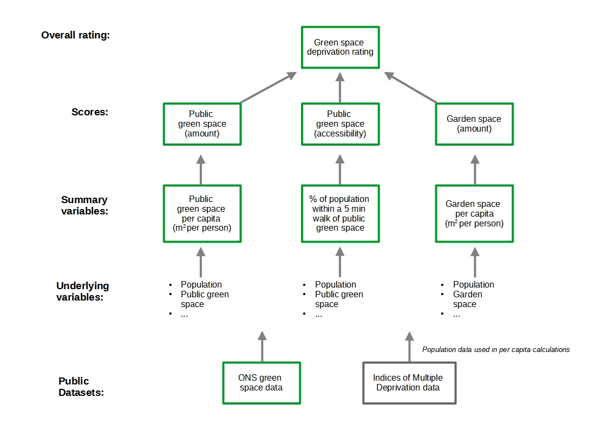

```{r knit_options, message = FALSE, echo = FALSE}
# set defaults for the appearance/supression of code chunks in the markdown doc
knitr::opts_chunk$set(message = FALSE, echo = FALSE)
```

```{r library_packages, include=FALSE}
library(tidyverse)
library(readxl)
library(RColorBrewer)
library(cowplot)
library(gt)
library(ggridges)
library(janitor)
library(kableExtra)
library(skimr)
```

```{r set_document_defaults}
# set the default ggplot theme for the whole notebook
theme_set(theme_minimal())

# set green to grey colour scale for use in tables and graphs
colour_palette <- scales::seq_gradient_pal(low = "palegreen4", high = "grey")
colour_scale <- colour_palette(seq(0, 1, length.out = 5))

# set the background colour for the table
background_colour <- "#EDEDED"
```

## Framing

**Audience:**

-   Friends of the Earth data analysis team
-   Myself - so I can look back on how my data analytics practice has developed

**Style:**

-   Blog-like, informal

## The Friends of the Earth - "England's Green Space Gap"

Friends of the Earth (FoE) have recently released a report focused on "[England's Green Space Gap](https://friendsoftheearth.uk/nature/englands-not-so-green-and-pleasant-land-millions-can-only-access-green-space-size-garden)". The headline finding of the report is that one in five people in England live in areas where it is difficult to access green space . The report also provides a holistic overview of why green space is so important, by highlighting how individuals and communities benefit from having access to both public and private green space. These benefits which stretch far beyond the natural environmental itself, and encompass a myriad of social, health and economic benefits.

As part of the research underpinning the Green Space Gap report, Friends of the Earth have developed a new approach for classifying the extent to which neighborhoods (or Middle Super Output Areas in the terminology of the administrative geography) across England experience green space deprivation. Neighborhoods are classified into five groups; with group A including the least green space deprived neighborhoods, and E including the most green space deprived.

Friends of Earth have released the dataset that they developed and used to classify green space deprivation within the Green Space Gap report. In this notebook I plan to conduct an exploratory data analysis using this Friends of the Earth dataset. Before doing so, I think it might be helpful to outline the way in which Friends of the Earth processed the dataset. This is outlined in the figure below and incorporated the following steps:



-   Accessing two ***Public Datasets*** from [the ONS](https://www.ons.gov.uk/economy/environmentalaccounts/datasets/accesstogardensandpublicgreenspaceingreatbritain) detailing: (1) the amount garden space and the accessibility of public green spaces (parks etc.); and (2), the extent of various forms of deprivation.

-   Identifying ***Underlying Variables*** of interest within these two datasets including for example the amounts of different forms of public green space.

-   Creating three ***Summary Variables*** by processing the ***Underlying Variables***. For example, calculating the percentage of population within each neighbourhood within 5 minutes walk of public green space.

-   Calculating green space ***Scores***from each of the three ***Summary Variables*****.**

-   Classifying each neighbourhood based on its green space ***Scores***into one of five green space deprivation ***Overall Ratings***.

Full details of the methodology used by Friends of the Earth can be found on page 36 of the Green Space Gap report.

*n.b.* In the report, Friends of the Earth draw on the Index of Multiple Deprivation (IMD) dataset to explore the relationship between the green space deprivation ratings and demographic factors including ethnicity and income.

## The Structure of this Exploratory Data Analysis

Reading the Green Space Gap report and exploring the associated dataset, I was struck by a number of questions about the nature and scope of green space deprivation in England. I thought that these questions might be a good basis for my exploratory data analysis.

-   What is the scale of the green space deprivation problem in England?

-   Is green space deprivation an urban problem?

-   How is green space deprivation distributed across regions in England?

-   What can the dataset tell us about what green space deprivation looks like in England?

Below I address each of these questions in turn with the aim of extending upon the analysis of the data presented in the report. By doing so, I hope to contribute to the wider debate on maintaining and extending access to green space during the post-covid recovery.

## Datasets Used

Ahead of moving on to the exploratory data analysis itself, I thought it would be helpful to very briefly document the datasets I used. This includes the Friends of the Earth dataset, and additional datasets from ONS which proved interesting or helpful in the context of my exploratory data analysis. In particular, I thought it was recording the versions of the dataset used where multiple version are available from the ONS

```{r document_datasets, echo=FALSE}

# create a dataframe for keeping track of the data sources used in this notebook
data_sources <- tribble(
  ~file_name, ~variable_name, ~notes, ~url,
  "(FOE) Green Space Consolidated Data - England - Version 2.1.xlsx", "green_space", "...", "https://friendsoftheearth.uk/nature/green-space-consolidated-data-england",
  "Local_Authority_District_to_Region__December_2019__Lookup_in_England.csv", "LAD_to_region", "used the December 2019 version", "https://geoportal.statistics.gov.uk/datasets/3ba3daf9278f47daba0f561889c3521a_0",
"RUC_MSOA_2001_EW_LU.csv", "urban_rural_classification", "2001 was the latest version available", "https://geoportal.statistics.gov.uk/datasets/rural-urban-classification-2001-of-msoas-in-england-and-wales" 
) %>% 
  # reorder variable for readability
  relocate(variable_name, .before = file_name)

# format the dataframe for inclusion in knitted document
# I was trying out some table formating packages in this doc 
# (so use different packages in different parts of this document)
data_sources %>% 
  kable() %>% 
  kable_styling()
```

```{r read_in_data, include=FALSE}

# read the core Friends of the Earth dataset
green_space <- read_excel("../Data/(FOE) Green Space Consolidated Data - England - Version 2.1.xlsx",
                          sheet = "MSOAs V2.1") %>%
  # inconsistent naming conventions for variables are used in the source data
  # some needed to clean names for consitency (variables names are now )
  clean_names()

# The FoE data doesn't include a variable for the region each MSOA/local authority lies within
# So, I imported a look up table from the ONS, which maps between Local Authority Districts and Regions
LAD_to_region <- read_csv("../Data/Local_Authority_District_to_Region__December_2019__Lookup_in_England.csv") %>% 
  select(-FID, -LAD19NM)


# adding region names and codes (from the ONS look up) to FOE green space data
green_space <- green_space %>% 
  left_join(LAD_to_region, by = c("la_code" = "LAD19CD")) %>% 
  relocate(RGN19CD, RGN19NM, .before = area) %>% 
  rename(region_code = RGN19CD,
         region_name = RGN19NM)

# the FoE green space data doesn't include a variable detailing where each MSOA is urban or rural.
# so again, I bring in another dataset from the ONS.
file_loc <- "../Data/Rural_Urban_Classification_(2001)_for_MSOAs_in_England_and_Wales/RUC_MSOA_2001_EW_LU.csv"

urban_rural_classification <- readr::read_csv(file_loc) %>%
  clean_names() %>% 
  select(msoa01cd, ruc01nm, ruc01cd, morphology_name, morphology_code, context_name, context_code)

# a quick check if any of the parsing problems relate to the columns of interest
columns_of_interest <-  c("MSOA01CD", "RUC01NM", "RUC01CD", "Morphology Name", 
                          "Morphology Code", "Context Name", "Context Code")  

probs_in_cols_of_interest <- problems(urban_rural_classification) %>% 
  filter(col %in% columns_of_interest) # there don't appear to be any issues here

# finally adding the urban-rural classifications to the core FoE green space dataset
green_space_urban_rural <- green_space %>% 
  left_join(urban_rural_classification, by = c("msoa_code" = "msoa01cd")) 

```

Ahead of conducting the exploratory data analysis I imported the three datasets and then merged into the single dataframe shown below. I have retain all the variables from the Friends of the Earth dataset in this dataframe, including non-green space variables from the Indices of Multiple Deprivation, in case they prove useful later in the analysis.

```{r show_merged_datasets}
green_space_urban_rural
```

## What is the scale of the green space deprivation problem in England?

```{r count_by_rating}

# for each green space deprivation rate calculate the numbers and proportions of msoas
msoa_by_rating <- green_space_urban_rural %>% 
  tabyl(green_space_deprivation_rating) %>%
  mutate(percent = percent * 100) %>% 
  rename(n_msoa = n,
         percent_msoa = percent)

# for each green space deprivation rate calculate the numbers and proportions of the population
pop_by_rating <- green_space_urban_rural %>% 
  group_by(green_space_deprivation_rating) %>% 
  summarise(population = sum(population_imd)) %>% 
  
  ungroup() %>% 
  mutate(percent_pop = population / sum(population) * 100)

# merge the msoa and population tables
msoa_and_pop_by_rating <- msoa_by_rating %>% 
  left_join(pop_by_rating, by = c("green_space_deprivation_rating" = "green_space_deprivation_rating"))

# add text labels for plotting below
bar_labels <- c("Large or very large gardens and large or \nvery large amounts of public green space",
                           "",
                           "",
                           "",
                           "Very small gardens and very small\namounts of public green space")

msoa_and_pop_by_rating <- msoa_and_pop_by_rating %>% 
  bind_cols(bar_labels) %>% 
  rename(bar_labels = `...6`)
```

This exploratory data analysis begins by focusing on the green space deprivation ratings of each English neighborhood. In this section of the analysis, I do not drill down into the underlying data that informs the ratings. More detailed exploration of the underlying data is picked up in the later sections of this notebook. But initially I wanted to get a better understanding of the green space deprivation ratings themselves, and their potential implications.

The first question I turn to is how many neighborhoods are considered green space deprived in the Friends of the Earth Analysis? The plot below shows the numbers of neighborhoods classified in each category. Reviewing the plot I noted that:

-   There is no strong trend in the relationship between the extent of green space deprivation (as defined by the FoE rating) and the number of neighborhoods receiving a given rating rating.
-   That said clearly fewer neighborhoods received the rating of D or E (representing the worst green space deprivation), than neighborhoods received a rating of A, B or C (representing less severe green space deprivation, and perhaps in some case representing green space affluence).
-   The number of neighborhoods receiving an A or B rating exceed 2000. Showing that green space deprivation, as defined by Friends of the Earth, is a widespread problem in England.
-   The most commonly occurring rating is C, the middle of the five green space deprivation ratings.

```{r plot_by_rating}
p <- ggplot(data = msoa_and_pop_by_rating,
            mapping = aes(x = green_space_deprivation_rating, 
                          y = n_msoa,
                          fill = green_space_deprivation_rating)
            )

p + geom_col() +
  geom_text(mapping = aes(label = bar_labels), hjust = 1.1, colour = "white", size = 3.5) +
  scale_fill_manual(values = colour_scale) +
      
  guides(fill = FALSE) +
  labs(title = "Numbers of neighbourhoods in England by green space\ndeprivation rating\n",
       x = "Green space deprivation rating\n\n",
       y = "\nNumber of Neighbourhoods\n",
       caption = "Source: Friends of the Earth, England's Green Space Gap") +
  
  theme(axis.text.x = element_text(face = "bold"),
            axis.text.y = element_text(face = "bold", size = 15),
            plot.title = element_text(face = "bold", size = 15)
            ) +
      
  coord_flip()

```

There are a small number of categories that a rating can fall into (A-E), and the ratings are based on simplified and abstracted representations of the ONS green space data (i.e. the green space ***scores*** shown as described in the introduction section above ). So, I do not think there is much value at this stage in considering descriptive statistics which summarise the distribution of green space deprivation ratings. At some point in might worth considering how the simplifications/abstractions used have affect the distributions of the ONS green space data, but I leave this to one side for now.

I am interested in how understanding in more detail the numbers and proportions of both neighborhoods and the population which are impacted by green space deprivation. To this end I produced the table below. The table separates the ratings in to two groups:

-   D and E: The neighborhoods rated as suffering the most extensive green space deprivation, and which FoE identify as in need of urgent action to improve access to green space.

-   A, B and C: Neighborhoods which FoE identify as in of action to protect green space and access to it, it the context of the long term trends which are reducing access to green space.

Reviewing the table I noted:

-   That around 30% of neighborhoods are rated either D or E, with around 17.84 million people (or 1 in 3 people) living in these neighborhoods and experiencing considerable green space deprivation.

-   Around 70% of neighborhoods are rated either A, B or C. With 25% of neighborhoods rated C and at risk of falling into considerable green space deprivation (i.e. ratings A and B) if green space and access to it is not protected over coming decades.

-   The percentages of neighborhoods and percentages of population are very similar in each rating group. So, considering the proportions of neighborhoods gives a fair indication of the proportions of the population affected.

```{r produce_rating_table}

# here I was experimenting with the gt (grammar of tables) package, as I was 
# looking for a relatively simple way to improve the appears of tables in 
# markdown documents. As you can see below, the code written to use gt is 
# very verbose ...

# creating two custom functions for colouring rows in the summary table
colour_gs_row <- function(df, colour, rating){
  df %>% 
    tab_style(style = list(cell_fill(color = colour_scale[[colour]])),
                locations = cells_body(rows = green_space_deprivation_rating == rating)
                )
}

colour_gs_rows <-  function(df){
  
  df %>% 
    colour_gs_row(colour = 5, rating = "E") %>%
    colour_gs_row(colour = 4, rating = "D") %>%
    colour_gs_row(colour = 3, rating = "C") %>%
    colour_gs_row(colour = 2, rating = "B") %>%
    colour_gs_row(colour = 1, rating = "A")
}


# set labels for grouping the rows in the table below
d_e_group_label <- "\nUrgent action needed to improve access to green space"
a_b_c_group_label <-  "\nAction needed to protect access to green space"


msoa_and_pop_by_rating %>%
  
  select(-bar_labels) %>% 
  
  add_column(group = c(rep(a_b_c_group_label, 3), rep(d_e_group_label, 2))) %>% 
  arrange(desc(green_space_deprivation_rating)) %>% 


  gt(rowname_col = "green_space_deprivation_rating", groupname_col = "group") %>%
  
    # add spanners
    tab_spanner(label = "Neighbourhoods",
                columns = 2:3) %>% 
  
    tab_spanner(label = "Population",
                columns = 4:5) %>% 
  
    # format columns
    fmt_number(starts_with("percent_"), decimals = 0) %>%
    fmt_number(vars(population), scale_by = 1e-6) %>%
  
    # create and format summary rows for each group
    summary_rows(groups = TRUE,
                 columns = vars(population),
                 fns = list(Total = ~sum(.)),
                 formatter = fmt_number,
                 scale_by = 1e-6) %>%
  
    summary_rows(groups = TRUE,
                 columns = vars(n_msoa, percent_msoa, percent_pop),
                 fns = list(Total = ~sum(.)),
                 formatter = fmt_number,
                 decimals = 0
                 ) %>%

    
    # colour rows using the function defined above
    colour_gs_rows() %>% 

    # add table labels
    tab_stubhead(label = html("Green Space<br>Deprivation<br>Rating")) %>%  
    cols_label(n_msoa = "Number",
               percent_msoa = "%",
               population = "Millions",
               percent_pop = "%") %>% 
    tab_source_note(source_note = md("**Source:** Friends of the Earth")) %>% 
    tab_header(title = md("**Green Space Deprivation in England**"),
               subtitle = md("Understanding the scale of the problem")
               ) %>%

    # adjust the appearance of table elements
    tab_options(heading.align = "left",
                heading.subtitle.font.size = 12,
                table.border.top.color = "black",
                column_labels.border.bottom.color = "black",
                column_labels.border.bottom.width = 3,
                column_labels.background.color = background_colour, 
                summary_row.background.color = background_colour,
                row_group.background.color = "#FFFFFF",
                stub.background.color = background_colour, 
                source_notes.font.size = 10) %>%
    
    # adjust styling of table text
    tab_style(style = list(cell_text(style = "italic")),
          locations = list(cells_body(columns = c(3,5)),
                           cells_row_groups(),
                           cells_summary(columns = vars(percent_msoa, percent_pop)))
          ) %>% 
  
    tab_style(style = list(cell_text(weight = "bold")),
          locations = list(cells_summary(),
                           cells_column_labels(everything())
                           )
          ) %>%
  
    tab_style(style = list(cell_text(size = 12)),
              locations = list(cells_row_groups(),
                               cells_column_labels(everything()))
              ) %>% 
  
  
    tab_style(style = list(cell_text(weight = "bold", size = 14)),
              locations = list(cells_stubhead(), 
                               cells_column_spanners(spanners = c("Neighbourhoods", "Population")),
                               cells_stub()
                               )
              ) %>% 

    tab_style(style = list(cell_text(align = "center")),
                           locations = cells_stub()
                           )
              
```

## How is green space deprivation distributed across regions in England?

```{r count_by_region}
# before looking at how the green space deprivation ratings are distributed across
# regions some data wrangling is needed
msoa_by_region_and_rating <- green_space_urban_rural %>% 
  
  # count by region and rating
  group_by(region_name, green_space_deprivation_rating) %>% 
  summarise(n_msoa = n()) %>% 
  filter(!is.na(region_name)) %>% 
  ungroup() %>% 

  # calculate rating proportions by region
  group_by(region_name) %>% 
  mutate(prop = n_msoa / sum(n_msoa)) %>% 
  ungroup()

```

Having explored how many neighborhoods and people are affected by green space deprivation across England as a whole, I was interested to understand if communities and people in some regions are more affected than others. In turn this could provide an indication of where action to alleviate green space deprivation is most needed. The plot below shows for each region the numbers the numbers of neighborhoods receiving each green space deprivation rating. Reviewing the plot I noted:

-   Over 450 of London's neighborhoods have been given the lowest rating (E). A further approximately 250 of London's neighborhoods are rated are rated D.
-   Outside of London, no other region has more than 150 neighborhoods receiving the lowest rating. This demonstrates that although green space deprivation is a nationwide issue, perhaps unsurprisingly it is most prominent in London (as the largest city in the country).
-   Overall, there are considerable inequities within each region in terms of access to green space. All regions include a mix of green space deprived (rated D and E) neighborhoods and considerably less deprived.


```{r plot_by_region_and_rating}
# as I was originally consider plotting both counts and proportions I wrote
# a plotting function that handle either (just to reduce the amount redundancy
# in the code).

plot_msoas_by_region <-  function(y_var){
  
  p <- ggplot(data = msoa_by_region_and_rating,
            mapping = aes(x = green_space_deprivation_rating, y = .data[[y_var]])
            )

  p + geom_bar(mapping = aes(fill = green_space_deprivation_rating),
             stat = "identity",
             colour = "grey80") +
  
  scale_fill_brewer(type = "div",
                    palette = "RdYlGn",
                    direction = -1) +
  
  guides(fill = FALSE) +
  
  coord_flip() +
  
  facet_wrap(~ region_name, ncol = 3)
}

plot_msoas_by_region("n_msoa") +
  labs(y = "\nNumber of Neighbourhoods",
       x = "Green Space Deprivation Rating\n\n",
       title = "Green space deprivation across the English regions\n")

# RETAIN CODE FOR PLOTITING PROPORTIONS (RATHER THAN COUNTS)
#plot_msoas_by_region("prop")

```
I was interest to understand in little more detail where the neighborhoods receiving the highest green space deprivation ratings (D and E). Below I plotted how the proportions of neighborhoods receiving a given rating (in this case D or E) are distributed across the English regions. Doing this involved addressing the challenge of how to ensure the colour associated with a given region was applied consistently across the two plots. This blog on [How to map a colour to a value of a categorical variable ...](https://www.stat.ubc.ca/~jenny/STAT545A/block17_colorsGgplot2Qualitative.html) was very helpful in addressing this challenge.

Reviewing the plot below I noted that:

-   For the highest green space deprivation ratings (D and E), the ranking of the regions is the same: (1) London, (2) North West, (3) South East, (4) Yorkshire and the Humber and (5) West Midlands.
-   Over half of MSOAs given the highest green space deprivation ratings (D and E) are accounted for by just two regions: (1) London and (2) the North West. This shows that the worst impacts of green space deprivation are concentrated is certain areas. 
- The scale of the green space deprivation issue varies cosniderably from region to region.


```{r setup_plot_gsdr_prop_by_region}
# The idea is to produce one bar chart for each green space rating, and across these plots use the same colour for a given region. 

# choose a palette to work with
region_pal <- brewer.pal(9, "Paired")

# map the region names to a specific colour value (in a dataframe for ease)
region_colours_df <- msoa_by_region_and_rating %>% 
  select(region_name) %>% 
  distinct(region_name) %>% 
  add_column(colour = region_pal)

# convert the region-colour mapping from a dataframe to a vector
# because a vector is required by scale_fill_manual
region_colours_vector <- region_colours_df$colour
names(region_colours_vector) <- region_colours_df$region_name

# count number of neighborhoods with each rating for use in the plot below
msoa_count <- msoa_by_region_and_rating %>% 
  group_by(green_space_deprivation_rating) %>% 
  summarise(n_msoa = sum(n_msoa))

# provide a look from rating (A-E) and counts of msoas
get_msoa_count <- function(rating){
  msoa_count %>% 
    filter(green_space_deprivation_rating == rating) %>% 
    select(n_msoa) %>% 
    as.integer()
}


plot_gsdr_prop_by_region <- function(rating = "A"){
  
    msoa_by_region_and_rating %>%
      
    # focus on the rating of interest
    filter(green_space_deprivation_rating == rating) %>% 
    mutate(proportion = n_msoa / sum(n_msoa)) %>%
    
    # create the bar chart
    ggplot(mapping = aes(x = reorder(region_name, proportion), 
                         y = proportion,
                         fill = region_name
                         )
           ) +
      
    geom_col() +
    
    # apply region-colour mapping  
    scale_fill_manual(values = region_colours_vector) +
    
    guides(fill = FALSE) +
      
    labs(title = str_c(get_msoa_count(rating), " neighborhoods were rated ", rating, "\n"),
         x = NULL,
         y = str_c("Proportion of ", rating, " rated neighborhoods")
         ) +
    
    coord_flip()
}

# produce one plot for each of the five green space deprivation ratings
gsdr_prop_by_region_plots <- c("A", "B", "C", "D", "E") %>%
  map(~ plot_gsdr_prop_by_region(.x))


```

```{r plot_gsdr_prop_by_region, fig.width = 12.5, fig.height=7}

# Add just the plots for D and E rated MSOA to a single figure

d_plot <- gsdr_prop_by_region_plots[[4]] + 
  ylim(0, 0.45) # ensure the plot axis scales match
  
e_plot <- gsdr_prop_by_region_plots[[5]] + 
  ylim(0, 0.45) # ensure the plot axis scales match

plot_grid(d_plot, e_plot, ncol = 2)
```

## Is green space deprivation an urban problem?

Having explored how green space deprivation is distributed across the English regions, I was interested to dig a little deeper into the question of where (in general rather than geographic sense) green space deprivation is a problem. In particular, it seems to intuitively make sense that green space deprivation is primarily an urban problem. I wanted to see if this intuition is born out by the data. 

This involved finding a dataset which classified MSOAs (i.e. neighborhoods) by whether or not they can be considered urban. Find the appropriate ONS dataset took a little time and effort, but in the end I found an urban-rural classification conducted in 2001. Obviously it is not ideal to use a twenty year old data, when over that period it is likely that some rural MSOAs on the edges of urban areas will have become more developed. There was a more recent urban-classification conducted but the results do not appear to have been released as open data (the result are displayed on a web-GIS).


The table below shows the breakdown of neighborhoods by both green space deprivation rating and the type of neighborhood as defined in the ONS dataset. With neighborhoods being classified into one of  three categories: (1) `urban > 10k`; (2) `town and fringe`; and, `Village Hamlet & Isolated Dwellings`. I also included an additional category for neighborhoods where it was not possible to identify an urban-rural classification (see column `NA_`). The percentages in the table sum to 100% column-wise. That is to say that the percentages show how the neighborhoods with each urban-rural classification breakdown over the five green space deprivation ratings.

Reviewing the table I noted that:

-   151 (approx. 2%) MSOAs in the Friends of the Earth dataset appear in the `NA_` column. In other words for these MSOAs it wasn't possible to identify if they were urban or rural. This isn't ideal, but I decide to omit MSOAs where no urban-rural classification is available from the analysis conducted in this section of the notebook. Having looked at the names of the MSOAs appearing in the `NA_` column I think it would be possible to conduct some name matching between the datasets to impute at least some of the missing urban-rural classification values. However, at this stage I am not sure if this is worth the effort.
-   There are only 8 neighborhoods outside of urban areas classified with a green space deprivation rating of D or E. This supports the idea that green space deprivation, at least in it's most acute forms, is almost exclusively an urban issue.
-   However, almost 40% of urban neighborhoods have green space deprivation ratings of A or B. This shows it has been possible for cities (and other urban areas) to develop in a way retains considerable amounts of green space for it's residents to enjoy. These urban neighborhoods with low green space deprivation ratings are a group that it would be interesting to explore further later in the analysis.

```{r}

green_space_urban_rural %>% 
  
  # count occurrences the combinations for the two variables of interest
  # i.e. create a two-way contingency table
  tabyl(green_space_deprivation_rating, morphology_name) %>%
  
  # structure and format summary table
  adorn_totals("row") %>% 
  adorn_percentages("col") %>% 
  adorn_pct_formatting(rounding = "half up", digits = 0) %>%
  adorn_ns() %>%
  
  # apply styling to table (here I'm trying out hte kable/kableExtra package)
  kable() %>% 
  kable_styling()

```
Reviewing the visual representation of the relationship - between green space deprivation rating and urban-rural classification of each neighborhood - below highlighted the following points.

* The majority of neighborhoods are classified as urban (approximately 80%). With approximately 10% of neighborhoods being classified as in the other two categories (Town and Fringe; Village and Isolated Homes).
* The approximately 30% of neighborhoods with the worst green space deprivation ratings are almost all located in urban areas.

```{r plot_green_space_dep_by_urban-rural}
neighborhood_type_labs <- c("Urban", "Town and\n Fringe", "Village and\nisolated\nhomes")

# reorder urban-rural classification levels for plotting
green_space_urban_rural <- green_space_urban_rural %>%
  mutate(morphology_name = fct_relevel(morphology_name, "Urban > 10K", "Town and Fringe", "Village Hamlet & Isolated Dwellings")) 

green_space_urban_rural %>%

  # calculate counts for the two variables of interest
  count(green_space_deprivation_rating, morphology_name) %>%
  
  # omit NAs or now and calculate proportions
  filter(!is.na(morphology_name)) %>%
  mutate(prop = round(n / sum(n), 2)) %>%
  
  #remove rating-type combination which account for less than 1% of total num of MSOAs (which have an urban-rural classification)
  filter(prop >= 0.01) %>%
  
  # dummy variable added to enable the use of different text colours in the plot
  mutate(text_colour = if_else(prop > 0.17, "grey", "white")) %>% 
  
  # create the plot itself
  ggplot(mapping = aes(y = morphology_name, x = green_space_deprivation_rating, fill = n)
         ) +
  
  geom_point(shape = 22, size = 20, colour = "grey50") +
  scale_fill_viridis_c() +
  
  geom_text(mapping = aes(label = prop,
                          colour = text_colour)) +
  scale_color_manual(values = c("grey15", "white")) + # adjust text colours for readability
  
  scale_y_discrete(labels = neighborhood_type_labs) + # rename for readability
  
  labs(title = "Where are green space deprived neighborhoods?\nAn urban-rural perspective.\n",
       subtitle = "The numbers within the boxes show proportions of English Neighborhoods.\nBoxes were not plotted for pairs accounting for proportions less than 0.01\n",
       y = "Neighbourhood type\n",
       x = "\nGreen space deprivation rating\n",
       fill = "Number of \nNeighborhoods",
       caption = "151 neighborhoods were omitted from this analysis as it\n was not possible to determine their neighborhood type") +
  
  guides(colour = FALSE)
```


```{r, eval=FALSE}
green_space_urban_rural %>% 
  ggplot(mapping = aes(x = green_space_area_per_capita,
                       y = morphology_name,
                       fill = morphology_name)) +
  geom_boxplot()
           
```

```{r, eval=FALSE}
green_space_urban_rural %>% 
  skim(green_space_area_per_capita) %>% 
  as_tibble() %>% 
  clean_names()
```

```{r, eval=FALSE}
green_space_urban_rural %>% 
  ggplot(mapping = aes(x = green_space_area_per_capita,
                       y = morphology_name,
                       fill = morphology_name)) +
  geom_boxplot() +
  coord_cartesian(xlim = c(0, 1000))

green_space_urban_rural %>% 
  ggplot(mapping = aes(x = garden_area_per_capita,
                       y = morphology_name,
                       fill = morphology_name)) +
  geom_boxplot() +
  coord_cartesian(xlim = c(0, 1000))

green_space_urban_rural %>% 
  ggplot(mapping = aes(x = pcnt_pop_area_with_go_space_access,
                       y = morphology_name,
                       fill = morphology_name)) +
  geom_boxplot() 
```

```{r, eval=FALSE}
green_space_urban_rural %>%
  filter(green_space_area_per_capita < 10000) %>% 
  filter(garden_area_per_capita < 1000) %>% 
  ggplot(mapping = aes(x = log(green_space_area_per_capita),
                       y = log(garden_area_per_capita),
                       colour = morphology_name)) +
  geom_point() +
  facet_wrap(~morphology_name)
```

## What can the dataset tell us about what green space deprivation looks like in England?
Having focused on the green space deprivation rating themselves so far, I was interested to understand more about the data that informed these ratings. The ratings are calculated using three green space scores (each ranging from 1 to 4), see page 36 of report for more details. In turn each of these scores was calculated based on (what I have called) summary variables:

1. **The garden area per capita (m^2^ per person) within the neighborhood - ** hopefully fairly self explanatory and referred to as `garden_area_per_capita` in the dataset;
2. **The public green space area per capita (m^2^ per person) - ** again hopefully fairly self explanatory (setting aside issues around the definition of public green space and how it might be identified) and referred to as`green_space_area_per_capita` in the dataset;
3. **The proportion of population within the neighborhood within 5 minutes walks of public green space - ** This is the most complex summary variable and is referred to as `pcnt_pop_with_go_space_access` in the dataset. For this variable FoE considered only public green spaces of two or more hectacres in size. I am unsure how FoE calculated values for this variable, I assume some form of GIS analysis was involved. The definition of this variable is based on a Natural England standard. In turn this standard is based on research indicating that people access green space within five minutes walk considerable more frequently that green space beyond five minutes walk.

In this section of the notebook I explore the distributions of, and correlations between, these three summary variables. Throughout this exploration I am seeking to better understand what green space deprivation looks like in England, and how this help me to better understand the FoE green space ratings. Which, in turn, I hope will inform my thinking about how to use statistical methods (e.g. k-means or k-medians clustering) to identify clusters of neighborhoods with similar green space characteristics. In this section I do however overlook for now the green space score variables, which FoE calculated from the summary variables. As each of the scores is essential a simplified version of one of the three summary variables.

Before looking at each of the summary variables in more detail I take a very quick look at some descriptive statistics. Reviewing the table below, I note that:

* The distributions of both `garden_area_per_capita` and `green_space_area_per_capita` are likely to be extremely right skewed. For example, the median value for `green_space_area_per_capita`is approximately 19m^2^ per person, the 75th percentile is approximately 48 and the maximum is over 100,000. So, when plotting these variables below it will probably be necessary to transform axis scales and/or omit very high values for green space areas from plots.
* Obviously there is not the potential for such extreme values of `pcnt_pop_with_go_space_access` as it is a percentage and so all values neccesarily lie in the range of 0 to 100.

```{r summary_variable_descriptive_statistics}
green_space_urban_rural

summary_var_desc_stats <- green_space_urban_rural %>% 
  skim(garden_area_per_capita, green_space_area_per_capita, pcnt_pop_with_go_space_access) %>% 
  as_tibble() %>% 
  clean_names() %>% 
  
  mutate(across(.cols = where(is.numeric), ~round(.x, digits = 2)))

summary_var_desc_stats
```


### Distributions of the summary variables 

```{r summary_variable_plotting_func}
# Define functions to be used across the plots in this section focused on summary variables
# *****************************************************************************************

#****************************
# Utility plotting functions
#****************************
count_outliers_removed <- function(df, variable, cutoff){
  
  # returns a count of msoa where a give variable exceeds as cutoff
  # used for calculating the number of msoas removed from a given plot
  
  df %>% 
    filter({{variable}} >= cutoff) %>% 
    tally() %>% 
    as.integer()
}

set_outlier_variables <- function(df, variable, cutoff){
  
  outlier_cutoff <- cutoff
  
  outliers_removed <- count_outliers_removed(df, {{variable}}, outlier_cutoff)
  
  maximum_point <- df %>%
    summarise(max = max({{variable}})) %>% 
    as.double()

  
  c(outliers_removed, maximum_point)
}


#****************************
# Background layer plotting
#****************************
add_plot_background_colours <- function(shading_boundaries, alpha = 0.4){
  # adds one of two background layers to a summary variable plot
  
  list(geom_rect(data = shading_boundaries,
                 mapping = aes(xmin = x_min, xmax = x_max, fill = score),
                 ymin = - Inf, ymax = Inf, alpha = alpha),
       
       scale_fill_brewer(palette = "YlGn")
  )
}

add_plot_background_lines <- function(shading_boundaries){
  # adds one of two background layers to a summary variable plot
  
  geom_vline(xintercept = shading_boundaries$x_max[1:3], colour = "grey50")
}

#****************************
# Core plotting functions
#****************************

green_space_histogram <- function(x, shading_boundaries, ...){
  # plots common elements of the summary variable histograms 
  
  list(
    
    # add the two background layers
    add_plot_background_colours(shading_boundaries),
    add_plot_background_lines(shading_boundaries),
  
    # add the plot of the data itself
    geom_histogram(mapping = aes(x = {{x}}), 
                   fill = "grey60", colour = "grey50",
                   ...),
    
    labs(y = "Number of Neighborhoods\n")
  )
}

green_space_boxplot <- function(x, y, gs_score, shading_boundaries){
  # plots common elements of the summary variable boxplots 
  
  list(add_plot_background_colours(shading_boundaries, alpha = 0.2),

      geom_jitter(mapping = aes(x = {{x}},
                                y = {{y}}),
                  alpha = 0.4,
                  colour = "grey80"),

      geom_boxplot(mapping = aes(x = {{x}}, 
                                 y = {{y}}),
                   alpha = 0.1,
                   colour = "grey30", size = 1,
                   outlier.alpha = 0),
      
      guides(colour = FALSE),
      
      labs(subtitle = "Each point plotted represents a neighborhood (i.e. a middle-layer super output area)")
      )
  
}
```


#### Garden area per capita


```{r garden_space_plotting_func}

# define functions to be used across the plots in the garden space per capita plots
# *****************************************************************************************

add_garden_plot_labels <- function(removed, cutoff, maximum){
  
  # adds labels which shared in all the garden space per capita plots
  labs(x = expression(paste("Garden area per capita (", m^2, " per person)")),
       caption = str_c(removed, " neighborhoods with garden area per capita \n between ", cutoff,
                       " and ", maximum, " omitted from the plot."),
       fill = "FoE Garden\nSpace Score"
       )
}

```

```{r garden_space_plot_setup}

# define the boundaries for background shading 
garden_shading_boundaries <- tibble(score = as_factor(c(1, 2, 3, 4)),
                             x_min = c(-Inf, 56.88, 85.89, 138.73),
                             x_max = c(56.88, 85.89, 138.73, Inf)
                             )

```

```{r garden_histogram}
# define cut off for outliers and count the number omitted from the plot
outlier_cutoff <- 800
out <- set_outlier_variables(green_space_urban_rural, garden_area_per_capita, outlier_cutoff)
outliers_removed = out[1]
max_garden_space = round(out[2])


# set the base layer of the plot
p <- ggplot(data = green_space_urban_rural)

# create summary variable histogram
p + green_space_histogram(x = garden_area_per_capita,
                          shading_boundaries = garden_shading_boundaries,
                          binwidth = 25) +
  
  labs(title = "How much garden area per person do English Neighborhoods have?\n",
       subtitle = "") +
  
  add_garden_plot_labels(removed = outliers_removed,
                         cutoff = outlier_cutoff, 
                         maximum = max_garden_space) +
  
  coord_cartesian(xlim = c(0, outlier_cutoff))
```


```{r garden_box_plot_rating}
garden_area_boxplot_rating <- function(cutoff = 800){
  
  out <- set_outlier_variables(green_space_urban_rural, garden_area_per_capita, cutoff)
  outliers_removed = out[1]
  max_garden_space = round(out[2])
  
  p <- ggplot(data = green_space_urban_rural)
  
  p + green_space_boxplot(x = garden_area_per_capita, y = green_space_deprivation_rating, 
                          gs_score = gsdi_garden,
                          shading_boundaries = garden_shading_boundaries) +
      
      add_garden_plot_labels(removed = outliers_removed,
                           cutoff = cutoff, 
                           maximum = max_garden_space) +
      
      labs(title = "Garden area per capita for English neighborhoods \n(broken down by the extent of green space deprivation)\n",
           y = "Green space deprivation rating\n") +
    
    coord_cartesian(xlim = c(0, cutoff))
}

garden_area_boxplot_rating()
garden_area_boxplot_rating(250)  
  
```

```{r garden_box_plot_urb_rur}
garden_area_boxplot_urb_rur <- function(cutoff = 800){
  out <- set_outlier_variables(green_space_urban_rural, garden_area_per_capita, cutoff)
  outliers_removed = out[1]
  max_garden_space = round(out[2])


p + green_space_boxplot(x = garden_area_per_capita, y = morphology_name, 
                        gs_score = gsdi_garden, 
                        shading_boundaries = garden_shading_boundaries) +
  
    scale_y_discrete(labels = c(neighborhood_type_labs, "Unknown")) + # rename for readability
    
    labs(title = "Garden area per capita for English neighborhoods \n(broken down by urban-rural classification)\n",
         y = "Neighborhood type\n") +
    
    add_garden_plot_labels(removed = outliers_removed,
                           cutoff = cutoff, 
                           maximum = max_garden_space) +
  
    coord_cartesian(xlim = c(0, cutoff))
}

garden_area_boxplot_urb_rur()
garden_area_boxplot_urb_rur(400)

```


```{r eval = FALSE}
rating_component_plots <- function(){
  
  # looking at the distribution of rating_component
  plot(p + geom_density())
  
  plot(p + geom_density(mapping = aes(fill = green_space_deprivation_rating),
                   alpha = 0.4))
  
  plot(p + geom_boxplot())
  
  plot(p + geom_histogram())
  
  
  # break down plotting_component distribution by green space deprivation rating
  p + geom_jitter(mapping = aes(y = green_space_deprivation_rating), 
                alpha = 0.2, 
                colour = "grey50") +
    geom_boxplot(mapping = aes(y = green_space_deprivation_rating,
                              fill = green_space_deprivation_rating), alpha = 0.5) +
    guides(fill = FALSE)
}

# produce plots for garden_area_per_capita
p <- ggplot(data = green_space %>% 
              filter(garden_area_per_capita < 4000),# remove one outlier around 
                                                    # 5000m2 to make plots readable
            mapping = aes(x = garden_area_per_capita)
            )

rating_component_plots()
# 
# # 
# p <- ggplot(data = green_space,
#             mapping = aes(x = log(garden_area_per_capita))
#             )
# 
# rating_component_plots()

grouped_summary(df = green_space, 
                grouping_var = green_space_deprivation_rating,
                summary_var = garden_area_per_capita) %>% 
  gt()
```


#### Public green space area per capita

```{r public_space_plotting_func}

# define functions to be used across the plots in the public green space per capita plots
# *****************************************************************************************

add_public_green_space_plot_labels <- function(removed, cutoff, maximum){
  
  # adds labels which shared in all the public green space per capita plots
  labs(x = expression(paste("Public green space area per capita (", m^2, " per person)")),
       caption = bquote(.(removed) ~ "neighborhoods with green space area per capita between" ~
                        .(cutoff) ~"and"~ .(maximum) ~ m^2 ~ "omitted from the plot."),
       fill = "FoE Public\nGreen Space\nScore"
       )
}

```

```{r public_space_plotting_setup}
# define the boundaries for background shading 
public_space_shading_boundaries <- tibble(score = as_factor(c(1, 2, 3, 4)),
                                          x_min = c(-Inf, 9, 33, 50),
                                          x_max = c(9, 33, 50, Inf)
                                          )
```


```{r public_space_histogram}

# set x axis cutoff
outlier_cutoff <- 500
out <- set_outlier_variables(green_space_urban_rural, green_space_area_per_capita, outlier_cutoff)
outliers_removed = out[1]
max_public_green_space = round(out[2])


# set the base layer of the plot
p <- ggplot(data = green_space_urban_rural)

# plot summary variable histogram
p + green_space_histogram(x = green_space_area_per_capita,
                          shading_boundaries = public_space_shading_boundaries,
                          binwidth = 10) +
  
  add_public_green_space_plot_labels(outliers_removed, outlier_cutoff, max_public_green_space) +
  coord_cartesian(xlim = c(0, outlier_cutoff)) +
  
  labs(title = "How much public green space per person do English Neighborhoods have?\n",
       subtitle = "")
  
```


```{r public_space_boxplot_rating}
public_gs_area_boxplot_rating <-  function(cutoff = 750){
  
  # set x axis cutoff
  out <- set_outlier_variables(green_space_urban_rural, green_space_area_per_capita, cutoff)
  outliers_removed = out[1]
  max_public_green_space = round(out[2])
  
  # set the base layer of the plot
  p <- ggplot(data = green_space_urban_rural)
  
  p + green_space_boxplot(x = green_space_area_per_capita, y = green_space_deprivation_rating, 
                        gs_score = gsdi_avg_area,
                        shading_boundaries = public_space_shading_boundaries) +
    
  add_public_green_space_plot_labels(outliers_removed, outlier_cutoff, max_public_green_space) +
  
  coord_cartesian(xlim = c(0, cutoff)) +
    
  labs(title = "Public green space per capita for English neighborhoods \n(broken down by the extent of green space deprivation)\n",
       y = "Green space deprivation rating\n")
  }


public_gs_area_boxplot_rating()
public_gs_area_boxplot_rating(cutoff = 100)


```
```{r public_space_boxplot_urban_rural}

public_gs_area_boxplot_urb_rur <-  function(cutoff = 1250){
  
  # set x axis cutoff
  out <- set_outlier_variables(green_space_urban_rural, green_space_area_per_capita, cutoff)
  outliers_removed = out[1]
  max_public_green_space = round(out[2])

  # set the base layer of the plot
  p <- ggplot(data = green_space_urban_rural)

  p + green_space_boxplot(x = green_space_area_per_capita, y = morphology_name, 
                        gs_score = gsdi_avg_area,
                        shading_boundaries = public_space_shading_boundaries) +
    
  add_public_green_space_plot_labels(outliers_removed, outlier_cutoff, max_public_green_space) +
    
  scale_y_discrete(labels = c(neighborhood_type_labs, "Unknown")) + # rename for readability

  coord_cartesian(xlim = c(0, cutoff)) +
    
  labs(title = "Public green space per capita for English neighborhoods \n(broken down by urban rural classifcation)\n",
       y = "Neighborhood type\n")
}

public_gs_area_boxplot_urb_rur()
public_gs_area_boxplot_urb_rur(cutoff = 200)

```
```{r gs_access_plotting_func}

# define functions to be used across the plots in the public green space per capita plots
# *****************************************************************************************

add_access_plot_labels <- function(){
  labs(x = "\nPercentage of the population within 5 minutes walk of public green space",
       fill = "FoE Public\nGreen Space\nAccess Score")
}
```

```{r gs_access_plotting_setup}
# define the boundaries for background shading 
access_shading_boundaries <- tibble(score = as_factor(c(1, 2, 3, 4)),
                                          x_min = c(-Inf, 25, 50, 75),
                                          x_max = c(25, 50, 75, Inf)
                                          )
```


#### The proportion of population within the neighborhood within 5 minutes walks of public green space
```{r}

# set the base layer of the plot
p <- ggplot(data = green_space_urban_rural)


p + green_space_histogram(x = pcnt_pop_with_go_space_access,
                          shading_boundaries = access_shading_boundaries,
                          binwidth = 2.5) +
  
  add_access_plot_labels() +
  
  labs(title = "How easy is it for people to access public green space\nin English Neighborhoods?\n")
  
  
```

```{r}
p + green_space_boxplot(x = pcnt_pop_with_go_space_access, y = green_space_deprivation_rating, 
                        gs_score = gsdi_access,
                        shading_boundaries = access_shading_boundaries) +
    
    add_access_plot_labels() +

    labs(title = "Accessibility of public green space across England's neighborhoods\n(broken down by the extent of green space deprivation)\n",
         y = "Green space deprivation rating\n")
```
```{r}
p + green_space_boxplot(x = pcnt_pop_with_go_space_access, y = morphology_name, 
                        gs_score = gsdi_access,
                        shading_boundaries = access_shading_boundaries) +
    
    add_access_plot_labels() +
    scale_y_discrete(labels = c(neighborhood_type_labs, "Unknown")) +# rename for readability
  
    labs(title = "Accessibility of public green space across England's neighborhoods\n(broken down by urban rural classifcation)\n",
       y = "Neighborhood type\n")
```


### Correlations between summary variables


### Understanding the role of the underlying variables


## Summary / Conclusions

-   

## Further work

-   A data-driven approach to classifying neighbourhoods (k means clustering)

-   Green space deprivation and Covid-19

-   The demographics of green space deprivation
- "These urban neighborhoods with low green space deprivation ratings are a group that it would be interesting to explore further later in the analysis."

-   

## The distribution of green space deprivation ratings across England

```{r, eval=FALSE}
# As a starting point - select the three indices (GSDI_...) that make up the rating (and the data that these indices are calculated from)
gs_dep_by_rating <- green_space %>% 

  select(green_space_deprivation_rating, 
         gsdi_avg_area, green_space_area_per_capita,
         gsdi_access, pcnt_pop_area_with_go_space_access, 
         gsdi_garden, garden_area_per_capita)

# trying to understand what a typical MSOA in each rating looks like ...
gs_dep_by_rating %>% 
  
  group_by(green_space_deprivation_rating) %>%
  summarise(mean_gs_per_c = mean(green_space_area_per_capita, na.rm = TRUE),
            median_gs_per_c = median(green_space_area_per_capita, na.rm = TRUE),
            mean_perc_pop_with_gs_access = mean(pcnt_pop_area_with_go_space_access, na.rm = TRUE),
            median_perc_pop_with_gs_access = median(pcnt_pop_area_with_go_space_access, na.rm = TRUE),
            mean_gard_area_per_C = mean(garden_area_per_capita, na.rm = TRUE),
            median_gard_area_per_C = median(garden_area_per_capita, na.rm = TRUE)
            )


```

## Green space area per capita

dealing with outliers Boxplot shows outliers at 1.5\*IQR + Q3 - they are part of the natural variability of the population, so it seems appropriate to retain the outliers, but zoom on the graphs because the .

```{r, eval=FALSE}
box_plot_mapping = aes(x = green_space_area_per_capita,
                       y = green_space_deprivation_rating)

# may be plotting will help to understand what a typical MSOA in each rating looks like
p <- ggplot(data = gs_dep_by_rating,
            mapping = box_plot_mapping
            )

p + geom_boxplot(aes(group = green_space_deprivation_rating))

# the outliers (in terms of very high values of green space per capita) are making it difficult to get a handle on the distributions
# so identify the approximate value where outliers begin
p <- ggplot(data = gs_dep_by_rating,
            mapping = aes(x = green_space_area_per_capita))

p + geom_boxplot()

# taking the dataset as whole outliers begin at approx. 62.5m2 gs per capita
# this seems like a low value to use as a cut off point for outliers
# so lets look at group A in detail
p <- ggplot(data = gs_dep_by_rating %>% 
              filter(green_space_deprivation_rating == "A"),
            mapping = box_plot_mapping)

p + geom_boxplot() +
  coord_cartesian(xlim = c(0, 1000))

# outliers from rating group A start at approximately 500m2 gs per capita
```

not sure on whether or not to filter out outliers

```{r, eval=FALSE}
p <- ggplot(data = gs_dep_by_rating, #%>% 
            #filter(green_space_area_per_capita < 500),
            mapping = box_plot_mapping
            )

p + geom_jitter(colour = "grey80") +
  geom_boxplot(mapping = aes(group = green_space_deprivation_rating, 
                               fill = green_space_deprivation_rating
                               ),
                 alpha = 0.5
                 ) + 
  coord_cartesian(xlim = c(0, 500)) +
  
  guides(fill = FALSE)

gs_pc_summary <- green_space %>% 
  group_by(green_space_deprivation_rating) %>% 
  summarise(
    min = min(green_space_area_per_capita),
    median = median(green_space_area_per_capita),
    max = max(green_space_area_per_capita),
    iqr = IQR(green_space_area_per_capita),
    mean = mean(green_space_area_per_capita),
    sd = sd(green_space_area_per_capita)
  )

gs_pc_summary
                 
```

```{r, eval=FALSE}
p <- ggplot(data = gs_dep_by_rating, #%>% 
              #filter(green_space_area_per_capita < 500),
            mapping = aes(x = green_space_area_per_capita,
                          y = green_space_deprivation_rating,
                          fill = green_space_deprivation_rating)
            )

p + geom_density_ridges(alpha = 0.5) + xlim(0,200) + 
  
  
  guides(fill = FALSE)
```

So, I wondered if the outliers/very long tail are a result of areas with small populations and/very large areas of green space.

```{r, eval=FALSE}
p <- ggplot(data = green_space,
            mapping = aes(x = population_imd,
                          colour = green_space_deprivation_rating)
            )

p + geom_point(mapping = aes(y = green_space_area), 
               alpha = 0.5) +
  
  labs(colour = "GS rating") +
  facet_wrap(~green_space_deprivation_rating)


p + geom_point(mapping = aes(y = log(green_space_area)),
               alpha = 0.5) +
  labs(colour = "GS rating")
```

```{r, eval=FALSE}
p <- ggplot(data = green_space, 
            mapping = aes(x = log(green_space_area),
                          )
            )
p + geom_density()


p <- ggplot(data = green_space, 
            mapping = aes(x = population_imd,
                          )
            )
p + geom_density()
```

So, it looks like the it is the green space area has much more influence on green space area per capita, than population.

```{r, eval=FALSE}
p <- ggplot(data = green_space,
            mapping = aes(y = green_space_area_per_capita,
                          colour = green_space_deprivation_rating)
            )

p + geom_point(mapping = aes(x = green_space_area), 
               alpha = 0.5) +
  labs(colour = "GS rating") +
  facet_wrap(~ green_space_deprivation_rating, scales = "free")

p <- p + geom_point(mapping = aes(x = population_imd), 
               alpha = 0.5) +
  labs(colour = "GS rating")

p

p + ylim(0, 500) + facet_wrap(~ green_space_deprivation_rating, scales = "free_y")
```

So, lets look at the distribution of `green_space_area` itself. This is relatively tricky given the wide range of values (as shown in the summary stats). I tried histograms and density plots too, but a box plot seemed the best way to understand the distribution. The first boxplot shows the full distribution and as a result is very difficult to interpret as the large outliers to the right of plot result in the box itself appearing as a single line and hence being very difficult to interpret. In the second plot hte x axis is cropped so it is straight forward to interpret the box component of the plot. However, this comes at the cost of failing to show the very large outliers within the distribution.

The extreme skew of the distribution can be seen in the summary statistics below. The median for `green_space_area` is 152,418 m2 while the maximum 636,087,671 m2.

```{r, eval=FALSE}

gs_area_summary <- function(variable, xlim){
  
  print(green_space %>% select({{variable}}) %>% summary())

  p <- ggplot(data = green_space,
              mapping = aes(x = {{variable}}))
  
  plot(p + geom_boxplot())
  
  p + geom_boxplot() +
    coord_cartesian(xlim = xlim)
  
}

gs_area_summary(green_space_area, c(0, 1e6))

# trying different lengths of the x axis to try to understand the distribution
  # p <- p + 
  #   geom_boxplot()
  # 
  # c(10, 100, 1000, 10000, 100000, 1e6, 1e7, 1e8, 1e9) %>% 
  #   map(~ p + coord_cartesian(xlim = c(0, .x)))
```

A similarly extreme right skewed distribution can seen for `green_space_area_per_capita`, as shown in the plots and summary stats below. It is worth noting just how atypical many of the larger outliers are. The median for `green_space_area_per_capita` is less than 20 m2 per capita, while the maximum is approximately 100,000 m2 per capita.

```{r, eval=FALSE}
gs_area_summary(green_space_area_per_capita, c(0, 100))
```

So, I thought it was worth a quick look at the population density across English MSOAs. The first graph shows the kernel density function for the population density of English MSOAs. Key features of the distribution include:

-   Approximating an exponential decline in density (a proxy for number of MSOAs) as population density increases.
-   The modal value being close to zero,

The second plot groups MSOAs by their FoE green space deprivation rating and highlights:

-   A rated MSOAs (those least green space deprived) tend to have low population density. For these MSOAs we again see an exponential decline in density as population density increases.
-   As green space deprivation increases (moving from rating A to E), the KDE's widen and seem to tend more toward a normal-like distribution.

```{r, eval=FALSE}
green_space %>% 
  select(population_density) %>% 
  summary()

p <- ggplot(data = green_space,
            mapping = aes(x = population_density
                          )
            )

p + geom_density()
p + geom_density(mapping =aes(fill = green_space_deprivation_rating),
                 alpha = 0.4)
```

Plotting population density against green space area and green space area per capita produces very associations. Note the log scales on both the x and y axis in both cases.

```{r, eval=FALSE}
p <- ggplot(data = green_space,
            mapping = aes(x = log(population_density),
                          colour = green_space_deprivation_rating
                          )
            )

p + geom_point(mapping = aes(y = log(green_space_area)),
            alpha = 0.25) +
  labs(colour = "GS rating")

p + geom_point(mapping = aes(y = log(green_space_area_per_capita)),
               alpha = 0.25) +
  labs(colour = "GS rating") 


```

## Green space access

-   From histogram:

    -   from 0 to approx. 40% the frequency distribution of `pcnt_pop_with_go_space_access` is uniform.
    -   from approx. 40% to 100% there is a negative linear association between `pcnt_pop_with_go_space_access` and frequency.

-   from the boxplot with grouping by rating

    -   ratings A,C and E have similar distributions of percentage populations with good access to green space.
    -   rating B and D have similar distributions of percentage populations with good access to green space.
    -   at each rating there is a wide variation in the percentage of populations with good access to green space

-   Overall it is not clear to what extent `pcnt_pop_with_go_space_access` is influencing the ratings ... would dropping it make much difference to how MSOA are classified?

-   75% `pcnt_pop_with_go_space_access` is used as a cut off point for some classifications. This figure seems high, it is at approximately the 95th percentile (see calculation below).

```{r, eval=FALSE}

rating_component_plots <- function(){
  
  # looking at the distribution of rating_component
  plot(p + geom_density())
  
  plot(p + geom_density(mapping = aes(fill = green_space_deprivation_rating),
                   alpha = 0.4))
  
  plot(p + geom_boxplot())
  
  plot(p + geom_histogram())
  
  
  # break down prating_component distribution by green space deprivation rating
  p + geom_jitter(mapping = aes(y = green_space_deprivation_rating), 
                alpha = 0.2, 
                colour = "grey50") +
    geom_boxplot(mapping = aes(y = green_space_deprivation_rating,
                              fill = green_space_deprivation_rating), alpha = 0.5) +
    guides(fill = FALSE)
}

p <- ggplot(data = green_space,
            mapping = aes(x = pcnt_pop_with_go_space_access)
            )

rating_component_plots()

# looking at assocation between pcnt_pop_with_go_space_access and the other 
# two variables that inform the green space deprivation rating
p + geom_point(mapping = aes(y = log(green_space_area_per_capita),
                             colour = green_space_deprivation_rating)
               )

p + geom_point(mapping = aes(y = log(garden_area_per_capita),
                             colour = green_space_deprivation_rating)
                 )

# calculate the percentile of the cutoff value used in FoE classification
percentile <- ecdf(green_space$pcnt_pop_with_go_space_access)
percentile(75)


green_space
```

```{r, eval=FALSE}
grouped_summary <- function(df, grouping_var, summary_var){
  df %>% 
    group_by({{grouping_var}}) %>% 
    summarise(min = min({{summary_var}}),
              median = median({{summary_var}}),
              max = max({{summary_var}}),
              iqr = IQR({{summary_var}}),
              mean = mean({{summary_var}}),
              sd = sd({{summary_var}})
    )
}

grouped_summary(df = green_space, 
                grouping_var = green_space_deprivation_rating,
                summary_var = pcnt_pop_with_go_space_access) %>% 
  gt()
  
```

## Garden space

```{r, eval=FALSE}

# produce plots for garden_area_per_capita
p <- ggplot(data = green_space %>% 
              filter(garden_area_per_capita < 4000),# remove one outlier around 
                                                    # 5000m2 to make plots readable
            mapping = aes(x = garden_area_per_capita)
            )

rating_component_plots()
# 
# # 
# p <- ggplot(data = green_space,
#             mapping = aes(x = log(garden_area_per_capita))
#             )
# 
# rating_component_plots()

grouped_summary(df = green_space, 
                grouping_var = green_space_deprivation_rating,
                summary_var = garden_area_per_capita) %>% 
  gt()
```

## Urban-rural classification and green space deprivation ratings

Rural-urban classification at LA scale

<https://www.gov.uk/government/statistics/local-authority-rural-urban-classification> Rural-Urban Classification of Local Authorities Post-2009 Boundaries

```{r, eval=FALSE}
readxl::read_xls("../Data/la-class-dataset-post0409.xls", sheet = "England")
```

Rural-urban classication at MSOA scale

<https://geoportal.statistics.gov.uk/datasets/rural-urban-classification-2001-of-msoas-in-england-and-wales> urban_rural_classification

```{r, eval=FALSE}

```

```{r, eval=FALSE}

```


**Some thoughts on where I am in understanding the FoE ratings and `green_space_area`:**

-   Given the distributions of `green_space_area` and `green_space_area_per_capita` it doesn't make sense to me to talk solely about green space deprivation. There are clearly places that are green space affluent ... For example, the typical (median) amount of green space area per capita for an MSOA is 20 m2. Whilst, the MSOA with the most green space per capita has approximately 5000 times more green space per capita than the typical MSOA. But I guess FoE are following the terminology/approach of the Indices of Multiple Deprivation dataset provided by the ONS.
-   Considering the typical (median) amount of `green_space_area_per_capita` for MSOAs in each rating (as shown in the table below) raises a question in my mind as the amounts of `green_space_area_per_capita` are relatively similar across ratings E to B ... Is it a different experience to live in a neighborhood with approximately 3m2 `green_space_area_per_capita` (as is typical for a E rated MSOA) or with approximately 16m2 `green_space_area_per_capita` (as is typical for a E rated MSOA)? Which got me wondering how much green space is enough [@russo2018] - it appear that this is a question that hasn't been the subject of too much research to date ...
-   

```{r, eval=FALSE}

gs_pc_summary

gs_pc_summary %>% 
  select(green_space_deprivation_rating, median, iqr)

green_space %>% 
  select(garden_area_per_capita) %>% 
  summary()


green_space

p <- ggplot(data = green_space,
            mapping = aes(x = green_space_area_per_capita,
                          y = garden_area_per_capita)
            )

p + geom_point()
```

# An alternative appraoch - clustering

<https://community.alteryx.com/t5/Alteryx-Designer-Knowledge-Base/Standardization-in-Cluster-Analysis/ta-p/302296>

```{r, eval=FALSE}
p <- ggplot(data = green_space_urban_rural)            

p + geom_density(mapping = aes(x = garden_area_per_capita))

p + geom_density(mapping = aes(x = log(green_space_area_per_capita + 1)))
p + geom_density(mapping = aes(x = log(garden_area_per_capita + 1)))
p + geom_density(mapping = aes(x = pcnt_pop_area_with_go_space_access))
```

-   I think it might be actively helpful to remove the right skew from the two green space variables in the context of looking at green space deprivation. Why?

    -   I don't there is much practically significant difference between having 10,000m2 and 100,000m2 per capita of public green space in terms people living there having a sense/experience of green space deprivation. And, the same probably holds for garden space too ...
    -   This might save on more complex work further down the line e.g. trying to define a green space utility function ...

-   The the data from all three variables definitely needs transforming to lie on a scale of 0 to 1, to ensure that the kmeans algorithm applies a roughly equal weight to each variable. When putting the raw data into kmeans, `green_space_area_per_capita` is the predominant factor in determining clusters due to the fact that it's values are much larger than those of the other variables ...

My initial efforts in transforming the data - a log transformation and then scaling values to the unit interval (i.e. 0...1) - proved rather unsuccessful. See the summary stats below, with the transformed values remaining tightly grouped together around the median.

```{r, eval=FALSE}
library(tidymodels)
library(tidyverse)
library(skimr)
library(kableExtra)

green_space_urban_rural %>%
  distinct(morphology_name, morphology_code) 
  
# select variables of interest  
cluster_variables <- green_space_urban_rural %>% 
  select(msoa_name,
         green_space_area_per_capita,
         pcnt_pop_area_with_go_space_access,
         garden_area_per_capita)


unit_interval <- function(x){
  (x - min(x)) / (max(x) - min(x))
}

# transform variable to try to remove skew
cluster_variables %>% 
  mutate(log_green_space_area_per_capita = log(green_space_area_per_capita + 1),
         log_garden_area_per_capita = log(garden_area_per_capita + 1), # +1 require because log(0) is not defined
         ui_log_green_space_area_per_capita = unit_interval(log_green_space_area_per_capita),
         ui_log_garden_area_per_capita = unit_interval(log_garden_area_per_capita)) %>%  
  skim() %>% 
  as_tibble()
  
```

So, I wondered about focusing on a subset of the data which could be easier to work with. Perhaps given the focus on green space deprivation it makes sense to remove those clearly green space affluent MSOAs (e.g. those with 10,000's m2 public green space per capita)


```{r, eval=FALSE}
# check for na's
cluster_variables %>%
  summarise(across(.cols = everything(),
                   .fns = ~sum(is.na(.))
                   )
            )

# remove labeling columns ahead running clustering algorithm
data_points <- cluster_variables %>%
  select(-msoa_name)

kclust <- kmeans(data_points, centers = 3)

# examine outputs
kclust
summary(kclust)

# add cluster identifier to the source data
augment(kclust, data_points)

# summarise per cluster
tidy(kclust)

glance(kclust)
```

```{r, eval=FALSE}
# subset variables to include in clustering
data_points_subset <- data_points %>% 
  select(green_space_area_per_capita,
         garden_area_per_capita)

data_points_subset %>% 
  summary()

data_points_subset

# run k_means clustering for k = 1 ... 9
# and for each cluster create outputs 
kclusts <- tibble(k = 1:9) %>% 
  mutate(k_clust = map(k, ~kmeans(data_points_subset, .x)),
         tidied = map(k_clust, tidy),
         glanced = map(k_clust, glance),
         augmented = map(k_clust, augment, data_points_subset)
         )

kclusts

# separate outputs for use in plotting
clusters <- kclusts %>% 
  unnest(cols = c(tidied))
clusters

assignments <- kclusts %>% 
  unnest(cols = c(augmented))
assignments

clusterings <- kclusts %>% 
  unnest(cols = c(glanced))
clusterings
```

```{r, eval=FALSE}
p1 <- ggplot(data = assignments %>% 
               filter(garden_area_per_capita < 1200), # remove single outlier at approx 5000 m2
             mapping = aes(x = green_space_area_per_capita,
                           y = garden_area_per_capita)
             )

p1 + geom_point(mapping = aes(colour = .cluster)) +
  facet_wrap(~ k)
```

## The distribution of green space deprivation ratings across the regions


## The geographic distribution of green space deprivation ratings

<https://datacarpentry.org/r-raster-vector-geospatial/06-vector-open-shapefile-in-r/>

```{r, eval=FALSE}
library(sf)

msoa_sf <- st_read("../Data/Middle_Layer_Super_Output_Areas/Middle_Layer_Super_Output_Areas__December_2011__Boundaries_EW_BFE.shp")

# msoa_sf <- raster::shapefile("../Data/Middle_Layer_Super_Output_Areas/Middle_Layer_Super_Output_Areas__December_2011__Boundaries_EW_BFE.shp")


msoa_sf_gs <- msoa_sf %>% 
  left_join(green_space, by = c("MSOA11CD" = "MSOA_Code"))


```

A quick visual inspection of the MSOAs colored by their green space deprivation rating, shows a similiar patter across the regions (with the exception of London). With the the D and E ratings (oranges and reds) occurring in smaller (presumably more densely populated MSOAs) which make up urban areas. While the larger, more rural MSOAs tend to be less green space deprived, and have A or B ratings. Given the whole region of London would probably be considered a continuous urban space, it is unsurprising to observe many green space deprived MSOAs across the region/plot, with relatively few less green space deprived areas present.

```{r, fig.width=10, eval=FALSE}

green_space_region_plot <- function(region){

  p <-  ggplot(data = msoa_sf_gs %>% 
                 filter(region_name == region),
               mapping = aes(fill = green_space_deprivation_rating)
               )
  
  p + geom_sf(colour = "grey75") +
    
    scale_fill_brewer(type = "div",
                      palette = "RdYlGn",
                      direction = -1) +
    
    labs(title = str_c("...", region))
}

region_names <- green_space %>%
  select(region_name) %>% 
  distinct(region_name)

region_names %>%
  filter(!is.na(region_name)) %>% 
  pmap(~ green_space_region_plot(region = .x))
  
```

# Ethnicity and green space deprivation

```{r, eval=FALSE}
green_space <- green_space %>% 
  mutate(prop_BAME_pop = BAME_Pop / Total_Pop_From_Ethnicity_Data) %>%
  relocate(prop_BAME_pop, .after = BAME_Pop)

p <- ggplot(data = green_space,
            mapping = aes(x = green_space_deprivation_rating,
                          y = prop_BAME_pop)
            )

p + geom_jitter(alpha = 0.5, colour = "grey75") +
  geom_boxplot(mapping = aes(fill = green_space_deprivation_rating), 
               alpha = 0.5, 
               size = 1.25,
               colour = "grey25") +
  
  scale_fill_brewer(type = "div",
                      palette = "RdYlGn",
                      direction = -1) +
  
  guides(fill = FALSE) +
  
  coord_flip()
  
```

```{r, eval=FALSE}


p <- ggplot(data = green_space,
            mapping = aes(y = green_space_deprivation_rating,
                          x = prop_BAME_pop,
                          fill = green_space_deprivation_rating)
            )

p + geom_density_ridges(alpha = 0.6, scale = 1.5) +
  scale_fill_brewer(type = "div",
                      palette = "RdYlGn",
                      direction = -1) 
```

# Wealth and green space deprivation

# Health and green space deprivation

## Covid and green space deprivation

# Archived code


```{r, eval=FALSE}


p <- ggplot(data = msoa_by_rating,
            mapping = aes(x = green_space_deprivation_rating, y = n_msoa)
            )

p + geom_segment(mapping = aes(x = green_space_deprivation_rating,
                               xend = green_space_deprivation_rating,
                               y = 750,
                               yend = n_msoa),
                 colour = "grey50",
                 size = 1.5
                 ) +
  
  geom_point(mapping = aes(fill = green_space_deprivation_rating),
             size = 7.5,
             shape = 21, 
             colour = "grey50", 
             stroke = 1.25
             ) +
  
  scale_fill_brewer(type = "div",
                    palette = "RdYlGn",
                    direction = -1) +
  
  
  labs(title = title_lab,
       subtitle = subtitle_lab,
       x = x_lab,
       y = y_lab,
       caption = caption_lab) +
  
  guides(fill = FALSE) +
  
  # facet_wrap(~ green_space_deprivation_rating) +
  
  coord_flip()
```

**Ideas:**

-   Plot idea - garden space vs. access to public green space - colour by rating ...
-   Use above and below median income to facet plots (as in covid-19) ...
-   Is there an equivalent approach for ethnicity? Where might the boundary be drawn (the national average proportion of BAME population)?
-   Green space affluent vs. green space deprived?
